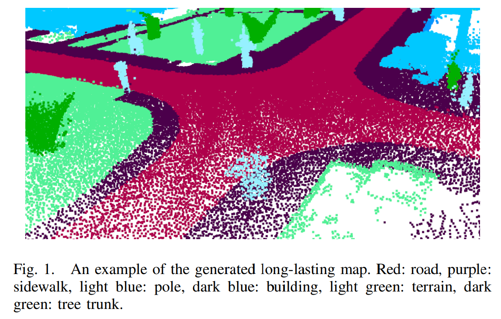

# 2021年1018-1022 arXiv SLAM相关新文一览

> 注：
>
> 1、arXiv 上提交的、未注明发表或被accepted的新文章**并未经过完整的同行评议**，**其内容真实性无法保证**，请小伙伴们阅读时务必注意；
>
> 2、本文仅作为我监督自己的约束手段，目的并不在于深入理解论文具体创新思想和算法原理，仅停留在非常浅的层次。每篇论文后均附有下载链接，arXiv的文章全球开放、免费访问，感兴趣的小伙伴可以自行下载阅读；
>
> 3、由于能力水平有限，我对于理解、阐述可能不到位的地方，还望各位大佬们不吝赐教。

- **Active Tapping via Gaussian Process for Efficient Unknown Object Surface Reconstruction - 基于高斯过程的主动拍击实现的高效未知物体表面重建**

  关键词：主动重建 未知物体 通过拍击实现物体重建

  机翻摘要：物体表面重建对机器人抓取、物体识别和物体操作具有重要意义。在用轻击法测量未知目标的表面分布时，最大的挑战是在不了解目标区域的前提下高效、准确地选择轻击位置。在给定搜索范围的情况下，我们提出了一种主动探索的方法，有效、智能地引导轻击对象学习物体表面，而不需要进行彻底的、不必要的外表面轻击。我们分析了我们的方法在比对象更大的探索范围内的物体表面建模的性能，使用配备了手臂末端敲击工具来执行敲击运动的机器人手臂。实验结果表明，该方法成功地模拟了未知物体表面，与先进的性能相比，所需水龙头的比例相对提高了59%。

  下载链接： http://arxiv.org/pdf/2110.09593v1

  注：做Active SLAM的小伙伴可借鉴本文的相关思想

- **Enhancing exploration algorithms for navigation with visual SLAM - 使用VSLAM增强的自主探索导航算法**

  关键字：VSLAM 自主探索

  机翻摘要：探索是机器人系统自主导航的重要环节。在本文中，我们介绍了一系列改进的探索算法，以便将它们与视觉SLAM方法结合使用。我们以两种模式评价所开发的方法：图像深度真值和神经网络重建深度图，二者分别作为vSLAM输入以评估勘探覆盖范围。

  投稿信息：submitted to RNCAI 2021

  下载链接：http://arxiv.org/pdf/2110.09156v1

  

  

- **Accurate and Robust Object-oriented SLAM with 3D Quadric Landmark Construction in Outdoor Environment - 精确鲁棒的、重建三维二次曲面路标的室外物体SLAM**

  关键词：对偶二次曲面路标 物体SLAM

  机翻摘要：面向物体的SLAM是自动驾驶和机器人领域的一种流行技术。在本文中，我们提出了一种具有鲁棒二次路标表示方法的立体视觉SLAM。该系统由深度学习检测、面向对象数据关联、对偶二次地标初始化和基于对象的姿态优化四个部分组成。基于二次多项式的SLAM算法往往面临观测相关问题，且对观测噪声敏感，限制了其在室外场景中的应用。针对这一问题，本文提出了一种基于二次参数解耦的二次初始化方法，提高了对观测噪声的鲁棒性。充分的目标数据关联算法和具有多线索的面向对象优化能够实现高度精确的目标姿态估计，对局部观测具有鲁棒性。实验结果表明，该系统对观测噪声具有更强的鲁棒性，在室外环境中明显优于现有的先进方法。此外，该系统还展示了其实时性。

  投稿信息：Submitting to RA-L

  下载链接：http://arxiv.org/pdf/2110.08977v1

  

- **Partial Hierarchical Pose Graph Optimization for SLAM - SLAM的部分层次位姿图优化**

  关键词：位姿图优化 局部分层优化 增量层次化 大位姿图优化

  机翻摘要：在本文中，我们考虑了一种用于SLAM的层次位姿图优化(HPGO)。我们提出了一种快速递增的方法来构建位姿图中的层次，研究了该方法的性质，结果表明该方法具有执行速度快、减约率高、灵活性好等优点。本文提出了一种局部分层优化方法，并与其他优化方法进行了比较。我们的实验结果表明，本文算法在给定一个包含大量节点的姿态时，相比原始优化方法，部分HPGO给出了10倍的速度且不牺牲质量。

  下载链接：http://arxiv.org/pdf/2110.08639v1

  

  

- **Lifelong Topological Visual Navigation - 长期运行的、基于拓扑信息的视觉导航**

  关键词：Lifelong，拓扑，室内视觉导航，端到端

  机翻摘要：机器人只用视觉导航的能力因其简单而吸引人。传统的基于视觉的导航方法需要一个预先的地图构建步骤，这个步骤很费力且容易失败，或者只能精确地遵循先前执行的轨迹。新的基于学习的视觉导航技术减少了对地图的依赖，而是采用了直接从图像输入中学习导航策略。目前有两种流行的范例:端到端方法完全放弃了显式的地图表示，和拓扑方法仍然保留一些松散的空间连接性。然而，端到端方法在远程导航任务中往往会遇到困难，而基于拓扑地图的解决方案由于图中存在伪边而容易失败。在这项工作中，我们提出了一个基于学习的拓扑视觉导航方法与图更新策略，提高终身导航性能随时间的推移。我们从基于采样的规划算法中获得灵感，构建基于图像的拓扑图，使得图更稀疏，但与基线方法相比，导航性能更高。此外，与从固定的训练环境中学习的控制器不同，我们展示了我们的模型可以使用来自机器人部署的真实环境的相对较小的数据集进行微调。我们进一步评估系统在实际部署中的性能。

  项目主页：https://montrealrobotics.ca/ltvn/

  下载链接：https://arxiv.org/pdf/2110.08488v1.pdf

  注：对于做拓扑建图的小伙伴也许会有所启发

  

  

- **Robust Edge-Direct Visual Odometry based on CNN edge detection and Shi-Tomasi corner optimization - 基于CNN边缘检测和Shi-Tomasi角点优化的鲁棒边缘直接法视觉里程计**

  关键词：边缘直接法 CNN边缘检测

  机翻摘要：本文提出了一种基于CNN边缘检测和Shi-Tomasi角点优化的鲁棒边缘直接法视觉里程计(VO)。该方法从图像中提取四层金字塔，以减少帧间的运动误差。该方法利用CNN边缘检测和Shi-Tomasi角点优化从图像中提取信息。然后，采用Levenberg-Marquardt (LM)算法进行姿态估计并更新关键帧。在RGB-D TUM数据集提供的位姿基准下，将该方法与稠密直接法、改进的Canny直接法以及ORB-SLAM2系统进行了比较。实验结果表明，本文提出的方法具有较好的鲁棒性和准确性。

  下载链接：http://arxiv.org/pdf/2110.11064v1

  

  

- **InterpolationSLAM: A Novel Robust Visual SLAM System in Rotational Motion - 帧插值SLAM：旋转运动下新颖的鲁棒视觉SLAM**

  > 注：这篇文章较早之前就提交 arXiv 了，不过不知道什么原因又提交了一次，并且覆盖了原文

  关键词：插帧技术

  机翻摘要：近年来，视觉SLAM在不同场景下取得了很大的进步和发展，但仍存在许多问题需要解决。SLAM系统不仅受外部场景的限制，还受其运动方式的影响，如运动速度、旋转运动等。Sepconvo-slomo和EDSC作为最优秀的帧插值网络的代表，可以高质量地预测前一帧和当前帧之间的中间帧。从直观上看，帧插值技术可以丰富受相机帧率限制的图像序列的信息，从而降低SLAM系统故障率的概率。在本文中，我们提出了一个插值slam框架。插值slam在单目和RGB-D配置的旋转运动中是健壮的。通过检测旋转并在旋转位置进行插补处理，可以更准确地估计系统的位姿，从而提高SLAM系统在旋转运动中的精度和鲁棒性。

  下载链接：http://arxiv.org/pdf/2110.11040v1

  

- **DVIO: Depth aided visual inertial odometry for RGBD sensors - DVIO：深度信息辅助的RGB-D-I里程计**

  关键词：RGB-D-I里程计 深度信息参与优化 深度特征参数化 深度信息估计非同步IMU和RGB-D之间偏移 

  机翻摘要：在过去的几年中，我们观察到移动设备中RGB-D传感器的使用有所增加。这些传感器可以很好地估计相机拍摄图像对应的深度图，可用于许多增强现实应用。本文提出了一种新的视觉惯性里程计(VIO)系统，该系统使用RGB-D传感器和惯性测量单元(IMU)传感器的测量数据来估计移动设备的运动状态。由此产生的系统称为深度辅助VIO (DVIO)系统。在该系统中，我们增加了深度测量作为非线性优化过程的一部分。具体来说，我们提出了使用一维(1D)特征参数化和三维(3D)特征参数化的深度测量方法。此外，我们建议利用深度测量来估计非同步IMU和RGBD传感器之间的时间偏移。最后，我们提出了一种新的基于块的边缘化方法，以加快边缘化过程，并保持整个系统的实时性。实验结果表明，该系统在轨迹精度和处理时间方面优于其他先进的VIO系统。

  下载地址：http://arxiv.org/pdf/2110.10805v1

  

  

  

-  **Robust Monocular Localization in Sparse HD Maps Leveraging Multi-Task Uncertainty Estimation - 基于多任务不确定性估计的稀疏高精地图下点鲁棒单目重定位**

  关键词：  城市场景 单目重定位 稀疏语义高精地图 不确定性

  机翻摘要：在密集的城市场景中，使用低成本传感器配置和稀疏高精地图实现鲁棒定位，与当前自动驾驶技术的发展高度相关，但仍是一个具有挑战性的研究课题。我们提出了一种新的单目定位方法，基于滑动窗口位姿图，利用预测的不确定性提高精度和鲁棒性，以应对具有挑战性的场景和可能每帧均故障的情况。为此，我们提出了一个高效的多任务不确定性感知模块，包括语义分割和包围盒检测，使车辆在只有车道边界和交通灯的稀疏地图中定位。此外，我们设计了直接从估计的不确定性产生到可微分成本图。这为以无关联和不确定性意识的方式最小化非定型地图元素的重投影损失提供了可能性。对Lyft 5数据集的充分评估表明，尽管地图稀疏，但我们的方法依旧能够在具有挑战性的城市场景中实现稳健和准确的六自由度定位。

  下载地址：http://arxiv.org/pdf/2110.10563v1
  
  
  
  

- **CoFi: Coarse-to-Fine ICP for LiDAR Localization in an Efficient Long-lasting Point Cloud Map - CoFi：用于LiDAR定位的粗到精ICP在高效、持续点云地图中的应用**

  关键词：ICP改进 多层分辨率的点云金字塔 语义特征 可持续在环境中存在的物体

  机翻摘要：近年来，激光雷达测距和定位技术引起了越来越多的研究兴趣。在已有的研究中，迭代最近点（ICP）算法因其精度高、效率高而得到了广泛的应用。然而，基于ICP的方法由于其非凸性和局部迭代策略，容易陷入局部最优，而这又需要精确的初始化。在本文中，我们提出了CoFi，一种用于激光雷达定位的、粗到细的ICP算法。具体来说，该算法在多体素分辨率下对输入点集进行降采样，并逐步细化从粗点集到细粒度点集的转换。此外，我们提出了一种基于地图的激光雷达定位算法，从激光雷达帧中提取语义特征点，并应用CoFi在高效的点云地图上估计姿态。CoFi定位算法在LiDAR扫描语义分割的圆柱体3d算法的帮助下，在KITTI里程测量基准上展示了最先进的性能，比文献有显著的改进。

  投稿信息：submitted to ICRA 2022

  下载地址：http://arxiv.org/pdf/2110.10194v1

  

