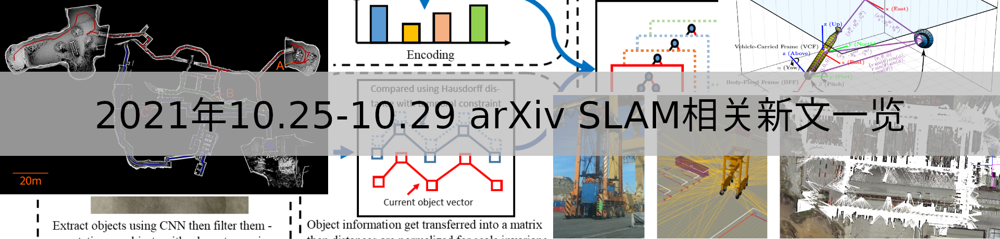
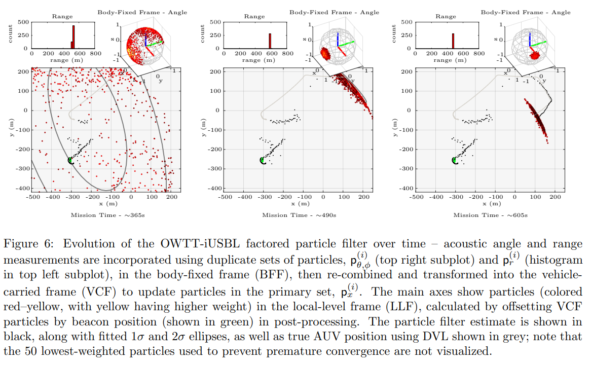
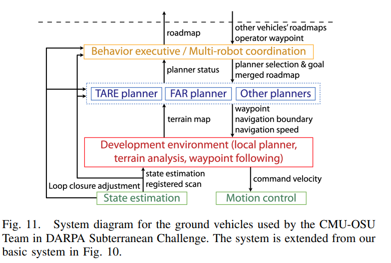

# 2021年1025-1029 arXiv SLAM相关新文一览

本周SLAM相关文章共12篇。

> 注：
>
> 1、arXiv 上提交的、未注明发表或被accepted的新文章**并未经过完整的同行评议**，**其内容真实性无法保证**，请小伙伴们阅读时务必注意；
>
> 2、本文仅作为我监督自己的约束手段，目的并不在于深入理解论文具体创新思想和算法原理，仅停留在非常浅的层次。每篇论文后均附有下载链接，arXiv的文章全球开放、免费访问，感兴趣的小伙伴可以自行下载阅读；
>
> 3、由于能力水平有限，我对于理解、阐述可能不到位的地方，还望各位大佬们不吝赐教。

- **Real-Time Ground-Plane Refined LiDAR SLAM - 实时地平面求精的LiDAR SLAM**

  关键词：多线激光SLAM 基于聚类的地平面提取 地平面点云配准

  机翻摘要：近年来，仅使用点云的SLAM系统已经被证明是成功的方案。这些系统中大多数算法在移出地面点云后提取特征进行跟踪，这在z轴上造成了很大位姿和建图不确定性。实际上地面点云提供了获得 $t_z$、$\theta_{roll}$、$\theta_{pitch}$ 的可靠信息。在这个项目中，我们拓展了LeGO-LOAM这个轻量、实时的SLAM系统，将提取和配准地面点云作为原生LOAM的一个额外部分。同时我们提出了一种新的基于聚类的方法改进等地平面提取算法，使得SLAM系统可以处理激光点云噪声更嘈杂或动态变化的环境。我们实现了该方法，并将其与LeGo-LOAM在CMU校园采集的数据以及ATV（全地形车，All-Terrain Vehicle）越野自动驾驶数据集上进行了比较。可视化结果和评估结果均表明本文算法有显著改进。

  下载链接：https://arxiv.org/pdf/2110.11517

  注：本文最初是为解决卡内基梅隆大学课程16833（Robot Localization and Mapping），在2019年春季学期的项目问题所编写、整理的。

  

  

- **SymbioLCD: Ensemble-Based Loop Closure Detection using CNN-Extracted Objects and Visual Bag-of-Words - SymbioLCD:  使用CNN提取对象和视觉词袋的回环检测**

  关键词：语义信息促进回环检测 

  机翻摘要：闭环检测是SLAM中减小漂移的重要工具。许多最先进的闭环检测（Loop Closure Detection，LCD）算法使用视觉词袋（Visual Bag-of-Words，vBoW）方案，对场景中的部分遮挡具有鲁棒性，但不能感知特征点之间的语义或空间关系，而使用CNN进行物体提取可以通过提供场景中物体之间的语义标签和空间关系来解决这些问题。之前的工作主要集中在用CNN得到的特征替换vBoW。本文中我们提出了SymbioLCD，一种新的基于集成的LCD，利用CNN提取的物体和vBoW进行候选回环信息点预测。当串在SLAM中使用时，添加的对象语义和空间感知元素创建了一个更健壮和共生的回环检测系统。提出的SymbioLCD使用了尺度不变的空间和语义匹配、带有时间约束的Hausdorff距离和随机森林（利用CNN提取的对象和vBoW特征的组合信息来预测准确的候选闭环）。对该方法的评估结果表明，它优于其他机器学习算法如支持向量机、决策树和神经网络，并表明CNN提取的目标信息和vBoW特征之间有很强的共生关系，这有助于准确的候选回环预测。此外，它利用CNN提取物体添加的空间和语义信息，能够比最先进的SLAM算法更早地感知候选回环对象。

  投稿信息：IROS 2021

  下载链接：https://arxiv.org/pdf/2110.11491

  

  

- **DIML/CVL RGB-D Dataset: 2M RGB-D Images of Natural Indoor and Outdoor Scenes - DIML/CVL RGB-D数据集：室内外自然场景下的两百万张RGB-D图像**

  关键词：RGB-D数据集 室内外场景 KinectV2+ZED双目立体相机+自建双目立体相机

  机翻摘要：本手册旨在提供DIML/CVL RGB-D数据集的详细描述信息。该数据集由两百万张彩色图像及其对应的各种自然室内外场景的深度图组成。室内数据集使用Microsoft Kinect v2构建，而室外数据集使用立体相机（ZED立体相机和自建立体相机）构建。文中总结了我们数据集的详细信息，包括获取、处理、格式和相关的工具箱等。

  网页：https://dimlrgbd.github.io/

  下载地址：https://arxiv.org/pdf/2110.11590v1.pdf

  注：本文属于技术汇报（Technical report）

  

  

  

- **WOLF: A modular estimation framework for robotics based on factor graphs - WOLF: 基于因子图的机器人模块估计框架**

  关键词：因子图优化 状态估计 多模态

  机翻摘要：本文介绍了基于因子图的、C++实现的移动机器人估计框架WOLF。WOLF将因子图的应用从SLAM和里程计的典型问题扩展到一个能够处理自校准、模型识别或非定位相关动态量观测的通用估计框架。WOLF可在高达几千Hz范围的传感器速率下产生高吞吐量的估计结果，可用于高度动态机器人（如类人机器人、四足机器人或空中飞行器)的反馈控制。与因子图框架不同，WOLF的体系结构允许实现一个模块化的、紧密耦合的估计器。模块化基于插件，并在运行时加载。然后，简单地通过YAML文件实现系统集成，这允许用户配置各种各样的应用程序而不需要编写或编译代码。输入数据的同步和因子图中独特的处理通过去中心化策略的帧创建和加入实现。大多数算法组件可以被编码为抽象算法基类地派生类，通过不同等级层次的特化实现。总的来说，这些算法组件支持一致的处理，有利于增强代码的可重用性和可伸缩性。WOLF提供了不同求解器对接口，例如我们为Ceres-solver提供了wrapper（国庆：这些名词，保持英文更好）。同样地，我们提供了ROS支持，包括通用的ROS节点，和订阅者、发布者的专用功能包。出于合作研究的目的，我们将WOLF公开，可开放使用。

  可执行文件：文章接收后开放

  文档链接：http://mobile_robotics.pages.iri.upc-csic.es/wolf_projects/wolf_lib/wolf-doc-sphinx/index.html

  下载地址：https://arxiv.org/pdf/2110.12919v1.pdf

  

  

  

  

  

  

- **EgoNN: Egocentric Neural Network for Point Cloud Based 6DoF Relocalization at the City Scale - EgoNN: 城市场景中基于点云的6自由度重定位Egocentric神经网络**

  关键词：开源（MIT协议） 城市场景重定位 激光点云重定位 全局特征+局部特征实现粗、精双阶段定位

  机翻摘要：本文提出了一种基于深度神经网络的方法，可用于从旋转三维激光雷达获取的点云中提取全局和局部描述子，进而将该描述子用于双阶段六自由度重定位。首先在粗定位阶段，通过在具有地理信息标记的点云数据库中寻找全局描述符，得到最接近的候选点；然后在精定位阶段，通过匹配局部描述子和使用鲁棒估计器（如RANSAC）估计查询点云（国庆：也就是当前点云）和数据库点云之间的6自由度位姿。我们的方法有一个简单的、完全卷积的、基于稀疏体素化表示的架构，能有效地从数万个点的大规模点云中提取全局描述子和一组局部特征（即具有局部描述子的关键点）。我们的代码和预训练模型在项目网站上公开。

  开源代码：https://github.com/jac99/Egonn

  下载链接：http://arxiv.org/pdf/2110.12486v1

  

  

  

- **Synchronous-Clock Range-Angle Relative Acoustic Navigation: A Unified Approach to Multi-AUV Localization, Command, Control and Coordination - 同步时钟的Range-Angle相对声学导航：多AUV定位、指挥、控制、协作的统一方法**

  关键词：水下机器人 协作AUV 声学导航 多机协作 声学定位

  机翻摘要：本文提出了一种可扩展的水下机器人统一指挥、控制和协作的声学导航方法。现有的多AUV（Autonomous Underwater Vehicles，自动水下潜航器）操作通常是利用无线电通信对水面上的单个潜航器进行编程，手动控制实现协调。这在潜航器数量庞大的情况下变得不切实际；或者需要在水下进行双向声通信以实现有限的协调，由于声通道的物理特性，扩展性有限。我们的方法利用一个单一的、定期广播的信标作为一组AUV的导航参考，每个AUV携带一个芯片级原子钟（CSAC，Chip-Scale Atomic Clock）和固定超短基线（USBL，Ultra-Short BaseLine ）声学接收机阵列。来自同步时钟的单向旅行时间（OWTT，One-Way Travel-Time）和每个阵列单元接收到的信号之间的时间延迟允许接收距离内的任何数量的潜航器确定距离、角度，从而确定它们与信标的相对位置。操作员可以通过从预定的广播信号中选择不同的潜航器行为来命令不同的AUV行为，而AUV之间的协调无需潜航器之间的通信，只需要在组内定义单独的潜航器行为。潜航器行为以信标为中心的移动参考框架设计，允许操作人员通过重新定位导航信标来测量感兴趣区域，进而来控制AUV组的绝对位置。本文对三艘小型、低成本的SandShark水下机器人进行了多次部署，实现了闭环的声波实时导航，通过第二长基线（LBL，Long-BaseLine）定位系统验证了实验结果，用真实数据证明了我们方法的能力和可靠性。

  下载链接：https://arxiv.org/pdf/2110.13825v1.pdf

  

  

  

  

  

  

  

  

- **Robust Multi-view Registration of Point Sets with Laplacian Mixture Model - 基于拉普拉斯混合模型的鲁棒多视图点云配准**

  关键词：多视图点云配准 拉普拉斯混合分布 重尾拉普拉斯分布 最大化期望 交替方向乘法器

  机翻摘要：点云集之间的配准是许多计算机视觉应用的关键步骤，如三维重建和SLAM。尽管目前存在许多不同用途的配准算法，但由于各种真实场景下不断增加的复杂性（如严重的噪声和离群值污染），该课题仍然具有挑战性。本文提出了一种基于重尾拉普拉斯分布（Heavy-tailed Laplacian distribution）的多点集同时对齐的概率生成方法。该方法假设每个数据点由拉普拉斯混合模型（Laplacian Mixture Model，LMM）生成，其中心由其他点集中的对应点确定。与以往基于高斯混合模型（Gaussian Mixture Model，GMM）的方法最大限度地减小高斯概率密度的点与中心的二次距离不同，LMM方法最大限度地减小了稀疏性引起的L1距离，从而对噪声和异常值具有更强的鲁棒性。我们采用期望最大化（Expectation-Maximization，EM）框架来求解LMM参数和刚体变换。利用李代数中的指数映射将L1优化近似为线性规划问题，通过内点法可以有效地求解L1优化问题。为了提高效率，我们还用交替方向乘法器（Alternating Direction Multiplier Method ，ADMM）求解L1优化。在鲁棒性和准确性方面，我们通过与具有代表性的最先进的基准挑战数据集的方法进行比较，证明了我们的方法的优势。

  下载链接：http://arxiv.org/pdf/2110.13744v1

  

  

- **Autonomous Exploration Development Environment and the Planning Algorithms - 自主环境探索和路径规划算法**

  关键词：开源 环境探索 路径规划 

  机翻摘要：Autonomous Exploration Development Environment是一个开源仓库，旨在促进高级规划算法的开发和完整自主导航系统的集成。该资源库包含有代表性的仿真环境模型、基本的导航模块，例如局部规划器、地形可穿越性分析、航路点（waypoint）跟踪和可视化工具。连同我们的两个高级规划器版本——用于探索的TARE规划器和用于路径规划的FAR规划器，我们详细介绍了这三个开源存储库的使用情况，并分享了集成自主导航系统的经验。我们使用DARPA underground Challenge作为一个用例，其中存储库共同构成了CMU-OSU团队的主要导航系统。最后，我们讨论了扩展应用程序中的一些潜在用例。

  项目网站：https://www.cmu-exploration.com/

  TARE开源代码：https://github.com/caochao39/tare_planner

  FAR开源代码：https://github.com/MichaelFYang/far_planner

  下载链接：https://arxiv.org/pdf/2110.14573v1.pdf

  注：前些时间泡泡机器人对相关研究进行了专题连载报道，并邀请了作者对TARE开展了一次公开课。下面为相关微信公众号推文链接：

  - [【泡泡前沿专栏•重磅】全网首发，CMU - LOAM 团队讲述最新自研全套开源自主导航算法（一）自主系统](https://mp.weixin.qq.com/s/_4yA5PWb-kIOMMzOzH4IUw)
  - [【泡泡前沿专栏•重磅】全网首发，CMU-LOAM团队讲述最新自研全套开源自主导航算法（二）DSV Planner自主探索算法](https://mp.weixin.qq.com/s/HZt0unquE08sOa6mFtS8jg)
  - [【泡泡前沿专栏•重磅】全网首发，CMU - LOAM 团队讲述最新自研全套开源自主导航算法（三）TARE自主探索算法](https://mp.weixin.qq.com/s/Dch5U0OOHaxfZM7GGWOEyQ)
  - [【泡泡前沿专栏•重磅】全网首发，系列(四)：CMU团队开发的全套开源自主导航算法——FAR Planner全局路径规划算法](https://mp.weixin.qq.com/s/RZpyu4gLv_3uqJyB2GPUgQ)
  - [【泡泡前沿专栏•重磅】全网首发，CMU - LOAM 团队讲述最新自研全套开源自主导航算法（五）扩展及应用](https://mp.weixin.qq.com/s/G3GOr11cAffiB-cJdOfcfg)
  - [【泡泡机器人公开课】Tare探索导航开源系统--张楫](https://mp.weixin.qq.com/s/Oj9yHMJAYUWpaPo77RFNjw)

  

  

  

  

  

- **A Comparative Study of Coarse to Dense 3D Indoor Scene Registration Algorithms - 粗糙到稠密的3D室内场景点云配准算法的比较研究**

  关键词：点云配准 评估 RGB-D 室内点云重建

  机翻摘要：三维点云对齐/配准已经成为三维扫描技术的重要组成部分。例如，我们可以将对齐过程分为四个步骤：关键点检测、关键点描述、初始姿态估计和配准求精。研究人员在文献中为每一步操作均提供了若干方法，自然地这标明为了做出正确的选择，需要进行对比研究。本文工作中，我们针对RGB-D数据，提出了一种描述和评价不同的3D配准算法的方法，以找到在使用廉价深度相机时，允许完整、准确重建室内3D场景的最佳算法组合。

  发表情况： Accepted in International Conference on Advanced Electrical Engineering (ICAEE)

  下载链接：https://arxiv.org/pdf/2110.15179v1.pdf

- **Multimotion Visual Odometry (MVO) - 多运动估计的视觉里程计**

  关键词：多物体运动估计 多运动分割 跟踪 临时遮挡 物理运动信息先验

  机翻摘要：视觉运动估计是自主导航中的一个研究热点。最近的工作关注于高动态环境下的多运动估计。这些环境不仅包含多种复杂的运动，而且往往表现出显著的遮挡。同时估计第三方物体运动和传感器运动是困难的，因为一个物体的观测运动包括它的真实运动和传感器运动。以往的多运动估计工作大多依靠基于外观的目标检测或特定于应用的运动约束来简化这个问题。这些方法在特定的应用和环境中是有效的，但不能很好地推广到完整多运动估计问题。本文提出了一种称为多运动视觉里程计（Multimotion Visual Odometry，MVO）的多运动估计处理流程，可以不依赖于外观信息，估计场景中每个运动物体的完整SE(3)轨迹，以及传感器自身运动。MVO通过多运动分割和跟踪技术扩展了传统的视觉里程计流程。它使用物理基础的运动先验来推断临时遮挡，通过Motion closure标识运动的再现信息。本文对来自牛津多运动数据集（Oxford Multimotion Dataset，OMD）和KITTI视觉基准套件的真实数据进行的评估表明，与同类方法相比，MVO实现了良好的估计精度，适用于各种多运动估计挑战。

  投稿信息：Under review for the International Journal of Robotics Research (IJRR)

  演示视频：https://www.youtube.com/watch?v=mNj3s1nf-6A https://www.youtube.com/playlist?list=PLbaQBz4TuPcxMIXKh5Q80s0N9ISezFcpi

  下载链接：http://arxiv.org/pdf/2110.15169v1

  

  

  

  

  

- **Efficient Placard Discovery for Semantic Mapping During Frontier Exploration - 边界探索过程中语义建图的高效标语牌发现**

  关键词：未知环境自主探索 语义地图中叠加门牌等信息

  机翻摘要：语义建图的任务是通过将语义信息附加到位置上，为机器人提供其环境的地图，这超出了传统SLAM算法的开放、可导航空间。本文工作中通过识别门牌，实现对地图中办公室的位置的标记。此前的相关工作中使用人工设计的检测器实现门派检测，本文系统则利用YOLOv2进行门牌检测，并利用分割网络进行分割，通过从分割的四边形轮廓计算单应矩阵恢复它们的姿态。这项工作还引入了可中断的边界探索算法，使机器人探索其环境，构建其SLAM地图，同时暂停检查在此过程中观察到的标牌。这使得机器人可以在不需要人工干预的情况下自主发现房间标语牌，大大加快了以前自主探索方法的速度。

  下载链接：https://arxiv.org/pdf/2110.14742v1.pdf

  

- **An Improved Positioning Accuracy Method of a Robot Based on Particle Filter - 基于粒子过滤的机器人定位精度改进方法**

  关键词：粒子滤波 单线激光雷达+陀螺仪+轮式编码器

  机翻摘要：本文旨在利用粒子滤波方法提高机器人的性能和定位精度。激光测距信息是一种无线导航系统，主要用于自主机器人的环境测量、定位和控制。它的定位控制比有线制导系统更灵活。然而，使用激光测距仪的导航算法在快速移动或转弯时，会产生较大的定位误差。针对这一问题，本文提出了一种在非线性或非高斯系统中使用具有鲁棒特性的粒子滤波器方法，提高机器人在室内环境中的定位精度。实验中机器人配备了激光测距仪、两个编码器和导航用陀螺仪，以验证定位精度和性能。该方法可提高定位精度和定位性能约85.5%。

  下载链接：https://arxiv.org/pdf/2110.14635v1.pdf

  

  

  