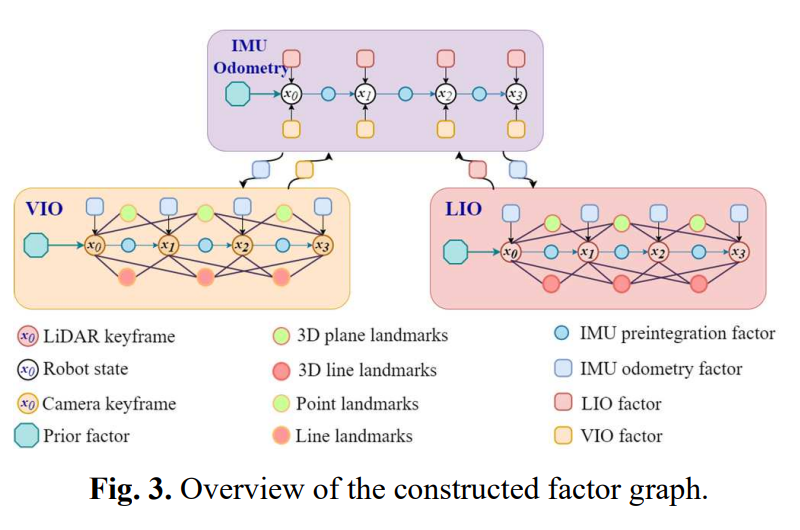
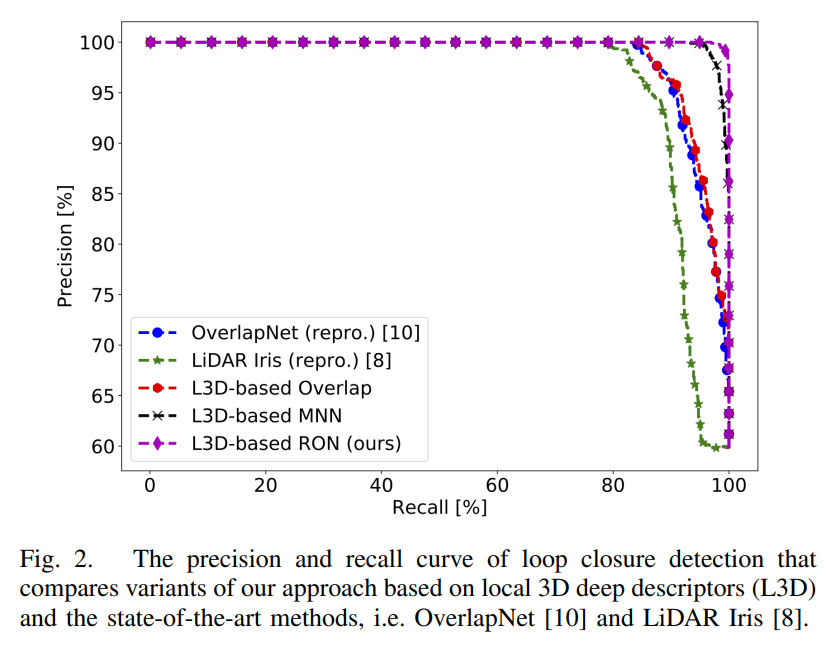

# 2021年1101-1105 arXiv SLAM相关新文一览

本周SLAM相关文章共6篇。

> 注：
>
> 1、arXiv 上提交的、未注明发表或被accepted的新文章**并未经过完整的同行评议**，**其内容真实性无法保证**，请小伙伴们阅读时务必注意；
>
> 2、本文仅作为我监督自己的约束手段，目的并不在于深入理解论文具体创新思想和算法原理，仅停留在非常浅的层次。每篇论文后均附有下载链接，arXiv的文章全球开放、免费访问，感兴趣的小伙伴可以自行下载阅读；
>
> 3、由于能力水平有限，我对于理解、阐述可能不到位的地方，还望各位大佬们不吝赐教。

- **Learning Inertial Odometry for Dynamic Legged Robot State Estimation - 用于动态足式机器人状态估计的基于学习的惯性里程计**

  关键词：IMU里程计 足式机器人 基于学习

  机翻摘要：本文提出了一种新颖的、从IMU测量数据学习位移的足式机器人状态估计方法。最近的行人跟踪研究表明，卷积神经网络可用于从惯性数据推断运动。在腿部里程计不可靠的场景（如滑动和可压缩地形）下，基于惯性位移测量学习的里程计可以改进状态估计。本文研究了如何从IMU数据估计位移，然后与传统的腿部里程计融合，这大大减少了机器人状态估计的漂移，这对于部署在视觉和激光雷达不支持的环境中（如雾蒙蒙的下水道或布满灰尘的矿井）的足式机器人至关重要。我们比较了EKF和增量fix-lag因子图估计器的结果，使用的数据来自几个真实的机器人穿越挑战性地形的实验。我们的结果表明，在挑战性场景下，相对于没有学习IMU测量的传统运动学-惯性估计器，相对位姿误差减少了37%。我们还证明，在视觉退化的环境（如地下矿井）中和使用视觉的里程计系统相比，本文方法可以减少22%的误差。

  投稿信息：To be presented at 5th Annual Conference on Robot Learning (CoRL), 2021

  下载链接：https://arxiv.org/pdf/2111.00789.pdf

  

  

- **MetroLoc: Metro Vehicle Mapping and Localization with  LiDAR-Camera-Inertial Integration - MetroLoc：针对地铁列车的激光雷达+视觉+惯性融合SLAM**

  关键词：LiDAR+Camera+IMU多模态定位 地铁SLAM 极端场景 IMU递推为中心 VR

  机翻摘要：我们提出了一种精确、鲁棒的多模态传感器融合框架，MetroLoc，用于最极端的场景之一，大规模地铁车辆定位和地图绘制。MetroLoc建立在一个以IMU为中心的状态估计器之上，该状态估计器将光探测和测距（LiDAR）、视觉信息和惯性信息通过松耦合方法紧密结合。该框架由三个子模块组成：IMU里程计、激光惯性里程计（LIO）和视觉惯性里程计（VIO）。IMU作为主要传感器，实现了LIO和VIO的观测，从而抑制了加速度计和陀螺仪的偏差。与以往仅关注点信息的LIO方法相比，我们的方法通过在运动估计中引入线、面特征，利用了更多的几何信息。VIO还通过使用线和点来利用环境结构信息。我们提出的方法已经在地铁环境中的维修车辆上进行了广泛的测试。实验结果表明，该系统在实时性的同时，比现有SOTA的方法具有更高的精度和鲁棒性。此外，我们开发了一系列面向高效、经济、交互式轨道车辆状态和轨旁基础设施监测的虚拟现实（VR）应用程序，并已部署在室外测试铁路上。

  下载链接：https://arxiv.org/pdf/2111.00762.pdf

  

  

  

  

- **TriVoC: Efficient Voting-based Consensus Maximization for Robust Point Cloud Registration with Extreme Outlier Ratios - TriVoC：基于投票的高效一致性最大化在极大匹配离群率下依旧鲁棒的点云配准**

  关键词：点云配准 投票 错误匹配点率大但配准精度依旧高

  机翻摘要：基于匹配的点云配准是机器人感知和计算机视觉的基石，它寻求从假定的对应关系中估计校准两个点云的最佳刚性变换。然而，由于三维关键点匹配方法的鲁棒性有限，在匹配点之间容易存在大量的异常点，这使得鲁棒配准方法变得十分必要。不幸的是，当面对高或极端的异常值比率时，现有的健壮方法有其自身的局限性(例如高计算成本或有限的健壮性)，可能不适合实际使用。针对鲁棒配准问题，本文提出了一种新的、快速的、确定性的、有保证的鲁棒求解器TriVoC（Triple-layered Voting with Consensus maximization，三层一致最大化投票）。我们将最小3点集的选择分解为3个连续的层，在每一层中，我们基于对等长约束设计了一个高效的投票和通信排序框架。这样，3点集就可以根据排序后的序列从精简的对应集中独立选择，在满足概率终止条件的前提下，大大降低了计算代价，同时也为获得最大的一致集（作为最终的inliers）提供了有力的保证。各种各样的实验表明，我们的求解器TriVoC在高达99%的异常值情况下是健壮的，即使在极端的异常值比率下也是非常精确、高效的，并且在真实世界的应用程序中也是实用的，显示出比其他SOTA的竞争对手具有更优越的性能。

  下载链接：https://arxiv.org/pdf/2111.00657.pdf

  

  

  

  

- **Loop closure detection using local 3D deep descriptors - 使用局部3D深度学习描述子的回环检测**

  关键词：待开源 回环检测 深度学习描述子 局部描述子

  机翻摘要：我们提出了一种简单而有效的方法，利用局部三维深度描述符（local 3D deep descriptors，L3Ds）来解决SLAM中的回环问题。L3Ds是通过深度学习算法，得到的点云块（patch）的紧凑表示形式。我们提出了一种新的回环检测重叠区域度量方法，该方法通过估计的相对姿态配准回环候选点云后，计算彼此最近邻描述子对应的点之间的度量误差。这种新方法使我们能够准确地检测闭环，并在小重叠的情况下估计传感器六自由度的姿态。我们将基于L3Ds的回环检测方法与激光雷达数据上的最新方法进行了比较，证明我们实现了最先进的回环检测检测精度。此外，我们将我们的闭环方法嵌入到最新的基于边缘的SLAM系统RESLAM中，并对真实世界的RGBD-TUM和合成ICL数据集进行评估。与原来的回环检测策略相比，我们的方法使RESLAM实现了更好的定位精度。

  下载链接：https://arxiv.org/pdf/2111.00440.pdf

  注：

  - 作者说出于公开发表的目的，本文已经提交IEEE，因此受限与版权问题 arXiv 上的当前版本可能在以后无法访问
  - 当文章接收后将开源代码

  

  

- **Multi-Objective Autonomous Exploration on Real-Time Continuous Occupancy Maps - 实时连续的占用地图基础上的多目标自主探索**

  关键词：自主探索 蒙特卡罗树搜索 贝叶斯希尔伯特图

  机翻摘要：在未知环境中使用移动机器人进行自主探索是许多机器人应用的支柱。现有的探索框架要么选择最近的几何边界，要么选择最近的信息理论边界。然而，仅仅因为一个边界本身是具有信息的，并不一定意味着机器人到达该边界后就会进入一个具有信息的区域。为了填补这一空白，我们提出使用蒙特卡罗树搜索的多目标变体，提供non-myopi的帕累托最优动作序列，将机器人引向未知区域的最大范围的边缘。我们还采用了贝叶斯希尔伯特图（Bayesian Hilbert Map，BHM）进行连续占有区域建图，使其更适用于实时任务。

  下载链接：https://arxiv.org/pdf/2111.00067.pdf

  

- **Efficient 3D Deep LiDAR Odometry - 高效的、基于深度学习的3D激光里程计**

  关键词：3D激光里程计 端到端

  机翻摘要：本文首次提出了一种适用于激光雷达里程计的高效三维点云学习架构PWCLO-Net。在该体系结构中，提出了三维点云的投影感知表示，将原始的三维点云组织成有序的数据形式，以提高效率。激光雷达里程计任务的金字塔（Pyramid）、扭曲（Warping）和代价量（Cost volume）（即PWC）结构被构建，以一种从粗到细的方法分层次且高效地估计姿态并求精。本文建立了投影感知的注意代价量（ projection-aware attentive cost volume），直接关联两个离散点云，获得嵌入运动模式。然后，提出了一种可训练的嵌入mask对局部运动模式进行加权，以回归整体姿态并过滤离群点。迭代使用可训练的位姿扭曲细化模块，并对嵌入mask进行层次优化，使位姿估计对异常值具有更强的鲁棒性。整个架构端到端的整体优化，实现cost volume和mask的自适应学习，所有涉及点云采样和分组的操作都通过投影感知的3D特征学习方法加速。最后本文在KITTI里程计数据集上验证了我们的激光雷达里程计体系结构的卓越性能。在大多数KITTI里程计数据集序列上，我们的方法优于所有最近的基于学习的方法，甚至优于基于几何的方法如带有建图优化的LOAM方法。

  下载链接：https://arxiv.org/pdf/2111.02135v1.pdf

  

  

  

  