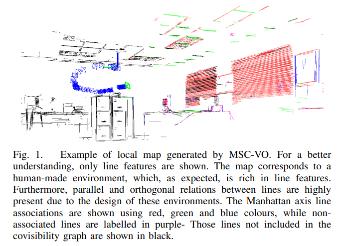

# 2021年1108-1112 arXiv SLAM相关新文一览

本周SLAM相关文章共10篇，其中已开源4篇，已注明待开源1篇。

> 注：
>
> 1、arXiv 上提交的、未注明发表或被accepted的新文章**并未经过完整的同行评议**，**其内容真实性无法保证**，请小伙伴们阅读时务必注意；
>
> 2、本文仅作为我监督自己的约束手段，目的并不在于深入理解论文具体创新思想和算法原理，仅停留在非常浅的层次。每篇论文后均附有下载链接，arXiv的文章全球开放、免费访问，感兴趣的小伙伴可以自行下载阅读；
>
> 3、文章同步更新于Github仓库：https://github.com/DreamWaterFound/SLAM-NewsPaper 欢迎 watch 和 star；
>
> 4、由于能力水平有限，我对于理解、阐述可能不到位的地方，还望各位大佬们不吝赐教。

- **Synchronized Smartphone Video Recording System of Depth and RGB Image Frames with Sub-millisecond Precision - 亚毫秒精度的深度图像和RGB彩色图像帧的同步智能手机视频记录系统**

  关键词：**开源** 时间同步的RGB-D+IMU采集系统 智能手机数据采集 硬件/软件时钟同步 

  摘要：本文提出了一种由智能手机、深度相机、IMU等异构传感器组成的高度时间同步精度的数据记录系统。由于学者们对智能手机的普遍兴趣和智能手机的广泛应用，我们的数据采集系统中至少有一款这样的智能手机设备提供数据。这个异构系统需要同步两种不同的时钟源：智能手机和MCU，我们结合了基于硬件连线线的触发同步和软件同步。我们在一个自定义的、新颖的系统下，评估了混合有源红外深度相机与RGB彩色相机的时间同步效果，证实我们的系统达到了毫秒级的时间同步精度。此外，我们的系统以这样的精度实现彩色-深度图像对的同步曝光。我们特别地展示了一个配置效果，并且我们系统采用的核心思想也可以在其他项目中使用。

  投稿信息：EEE Sensors Journal submitted paper

  部分设计开源：https://github.com/MobileRoboticsSkoltech/bandeja-platform

  下载链接：https://arxiv.org/pdf/2111.03552v1.pdf

  注：时间同步效果验证的实验蛮有意思，巧妙利用了卷帘快门相机每行扫描的特性

  

  

  

  

- **Small UAVs-supported Autonomous Generation of Fine-grained 3D Indoor Radio Environmental Maps - 小象无人机支持的细粒度室内3D无线电环境地图自主生成**

  关键词：无线电环境地图 无人机 室内环境

  摘要：无线电环境地图（Radio Environmental Maps，REMs）是一种增强各种通信和网络代理性能的强大工具。然而，REMs的生成是一项艰巨的任务，特别是在室内这种复杂的三维环境中。为了解决这个问题，我们提出了一个自主生成室内三维空间细粒度REMs的系统。该系统采用多架小型室内无人机（Unmanned Aerial Vehicles，UAVs）对信号质量指标进行三维采样。收集的读数被简化到机器学习系统进行训练，一旦训练完成，该系统就能够预测未知3D位置的信号质量。该系统能够自动生成REM，并且可以直接部署在新的环境中。此外，该系统支持无自干扰的REM采样，并且只要REM采样接收器具有适合无人机携带的尺寸和重量，可以不考虑技术层面的细节（technology-agnostic）。在实验演示中，我们使用两架无人机作为本系统设计的一个实例，展示了其访问72个航路点和收集数千个Wi-Fi数据样本的能力。我们的结果还包括机器学习系统的实例展示，用于预测无人机在尚未访问位置处，已知Wi-Fi接入点的接收信号强度（Received Signal Strength，RSS）。

  下载链接：https://arxiv.org/pdf/2111.03451v1.pdf

  

  

- **MSC-VO: Exploiting Manhattan and Structural Constraints for Visual Odometry - MSC-VO：利用曼哈顿假设和结构约束的视觉里程计**

  关键词：**开源** 视觉里程计 结构化环境+普通环境 曼哈顿假设 RGB-D输入 点线特征结合

  摘要：当面对低纹理的场景如人造环境中时，由于通常很难找到足够数量的点特征，视觉里程计算法往往会退化。另一种几何视觉线索，如线特征，通常可以在这些场景中找到，可能变得特别有用。此外，这些场景通常呈现出结构上的规律性，如并行性或正交性，并符合曼哈顿世界假设。在这些前提下，我们引入MSC-VO，一种基于RGB-D的视觉距离测量方法，如果环境存在这些结构规律和曼哈顿假设中的“轴”，则综合利用率点线特征。本文方法中，这些结构约束最初用于准确估计提取线的3D位置，然后将这些约束条件与估计的曼哈顿轴和点、线的重投影误差相结合，通过局部地图优化来优化相机的姿态。这样的组合使我们的方法能够在没有上述结构信息约束的情况下运行，允许该方法适用于更广泛的场景。此外，我们提出了一种主要依赖于线特征的多视图曼哈顿轴估计新方法。MSC-VO在几个公共数据集上的评估结果显示其优于其他SOTA的解决方案，甚至可以与一些SLAM方法媲美。

  投稿信息：**RAL** + **ICRA 2022**

  开源代码：https://github.com/joanpepcompany/MSC-VO

  下载链接：https://arxiv.org/pdf/2111.03408v1.pdf
  
  

  

  

  

  

- **LiODOM: Adaptive Local Mapping for Robust LiDAR-Only Odometry - LiODOM：用于鲁棒LiDAR里程计的自适应局部建图**

  关键词：**开源** LiDAR里程计 数据关联 环境高效表示

  摘要：在过去的几十年里，光探测和测距（LiDAR）技术作为一种强大的自定位和建图替代技术得到了广泛的探索。这些方法通常将自我运动估计作为一个非线性优化问题，依赖于当前点云和地图在局部或是全局范围内建立的对应关系。本文提出了一种新的LiODOM方法，它是一种只用激光雷达的测距和测绘方法，用于姿态估计和地图构建。该方法基于损失函数的最小化，损失函数由一组从可用点云集合中提取的、局部地图的、加权的点对线对应关系得到。此外，因为与快速数据关联的相关性，这项工作特别强调地图表达形式。为了有效地表示环境，我们提出了一个数据结构，该结构结合了一个哈希方案，允许快速访问地图的任何部分。LiODOM在公共数据集上的一系列实验进行了验证，并与其他解决方案进行了比较。本文也报告了它在空中无人机平台上的性能。

  投稿信息：Submitted to IEEE Robotics and Automation Letters

  开源代码：https://github.com/emiliofidalgo/liodom

  下载链接：https://arxiv.org/pdf/2111.03393v1.pdf

  

  

  

  

- **Hierarchical Segment-based Optimization for SLAM - 基于分层分段的SLAM算法优化**

  关键词：误差大的多优化，误差小的用插值代替优化 轨迹分段 因“误差”制宜

  摘要：提出了一种基于分层、分段的SLAM系统优化方法。首先我们提出了一种可靠的轨迹分段方法，可用于提高后端优化的效率。在此基础上首次提出了一种缓冲机制，以提高分割的鲁棒性。在优化过程中，我们利用全局信息对误差较大的帧进行优化，用插值代替优化更新估计良好的帧，根据每帧的误差层次分配计算量。在数据集基准上的对比实验表明，该方法在几乎不降低精度的情况下，大大提高了优化效率，大大优于现有的高效优化方法。

  发表：**IROS 2021**

  下载链接：https://arxiv.org/pdf/2111.04101.pdf

  

  

  

  

  

- **Online Adaptation of Monocular Depth Prediction with Visual SLAM - 单目深度预测的视觉SLAM在线自适应**

  关键词：SLAM促进深度学习 深度估计与SLAM结合 深度估计泛化能力提升

  摘要：卷积神经网络CNN的精确深度估计能力是它在实际视觉SLAM应用（如增强相机跟踪和稠密建图）中广泛应用的一个主要挑战。本文旨在回答以下问题：即使CNN没有针对当前的应用环境进行训练，我们能否借助视觉SLAM算法对深度估计的CNN网络进行调优以提高SLAM性能？为此，我们提出了一种新的在线自适应框架，该框架由两个互补过程组成：一个是SLAM算法，用于生成关键帧来微调深度估计网络，另一个是使用在线自适应的深度估计来提高构建地图的质量。一旦潜在的噪声地图点被去除，我们执行全局BA以提高整体SLAM性能。在基准数据集和实际机器人上的实验结果表明，本文方法提高了SLAM的重建精度。我们演示了在训练损失中使用正则化作为防止灾难性遗忘的有效手段。此外，我们将我们的在线自适应框架与最先进的预训练深度估计CNN网络进行了比较，表明我们的在线自适应深度估计CNN网络优于在大量数据集上训练的。

  下载链接：https://arxiv.org/pdf/2111.04096.pdf

  

  

  

  

- **Practical, Fast and Robust Point Cloud Registration for 3D Scene  Stitching and Object Localization - 实用、快速、鲁棒的三维场景拼接与目标定位点云配准**

  关键词：**开源** 点云配准 错误匹配关系非常多依旧可以鲁棒地配准 投票 旋转平均 Tukey

  摘要：三维点云配准是遥感、摄影测量、机器人和几何计算机视觉中最基本的问题之一。由于三维特征匹配技术的精度有限，在匹配对应关系中可能存在异常值，有时异常值甚至非常多。鉴于现有的鲁棒求解器可能存在计算代价高或鲁棒性受限的问题，我们提出了一种快速、鲁棒性高的解决方案，即VOCRA（VOting with Cost function and Rotating Averaging，代价函数投票和旋转平均），用于解决极端离群率的点云配准问题。我们的第一个贡献是使用Tukey的双权鲁棒代价来引入新的投票和关联排序技术，该技术被证明在即使是极端（99%）的异常值率下，也能有效区分真正的inliers和outliers。我们的第二个贡献在于设计了一个基于鲁棒旋转平均的高效一致最大化框图，可用于在对应关系中寻找更早的候选目标。最后，我们利用带有Tukey's Biweight （GNC-TB）的梯度非凸性来估计正确的inlier候选变换，然后用它来寻找完整的inliers点的集合。我们进行了标准基准测试和实际实验，并将其应用于两个真实数据下的问题，结果表明我们的解决方案VOCRA在超过99%的异常值下是鲁棒的，比最先进的对比方案更省时。

  开源代码：https://github.com/LeiSun-98/VOCRA 

  下载链接：https://arxiv.org/pdf/2111.04228.pdf

  注：和这篇是一个工作：https://arxiv.org/pdf/2111.00657.pdf

  

  

  

  

- **Structure from Silence: Learning Scene Structure from Ambient Sound - 从环境声中学习场景结构**

  关键词：**即将开源** 基于声音的SfM 深度学习

  摘要：从旋转的吊扇到滴答作响的时钟，我们听到的声音随着场景的移动而细微变化。我们询问这些环境声音是否传达了关于3D场景结构的信息，如果是的话，它们是否为多模态模型提供了有用的学习信号。为了研究这一点，我们从各种安静的室内场景中收集了配对音频和RGB-D录音数据集。然后我们训练模型来估计到附近墙壁的距离，只给出音频作为输入。我们还利用这些录音通过自我监督，通过训练网络将图像与相应的声音联系起来，来学习多模态表征。这些结果表明，环境声音传达了关于场景结构的惊人数量的信息，并且它是学习多模态特征的有用信号。

  发表信息：Accepted to CoRL 2021 (Oral Presentation)

  项目主页：https://ificl.github.io/structure-from-silence/

  下载链接：https://arxiv.org/pdf/2111.05846v1.pdf

  

  

  

  

  

- **TomoSLAM: factor graph optimization for rotation angle refinement in microtomography - TomoSLAM：CT成像中旋转角度优化的因子图优化**

  关键词：医疗领域的SLAM应用 CT机上用SLAM技术促进成像、重建精度 控制信号（电机运动）参与因子图优化 SURF特征

  摘要：在计算机断层扫描（Computed Tomography，CT）中，样品、检测器和信号源的相对轨迹通常被认为是已知的，因为它们是由仪器部件的预先编程故意运动引起的。然而，由于机械侧隙、旋转传感器测量误差、热变形等原因，实际轨迹与期望轨迹存在差异。这对层析成像重建的质量有负面影响。设备的校准和初步调整都不能完全消除轨迹的不准确性，但显著增加了仪器维护成本。解决这一问题的许多方法是基于自动求精的，具体表现在重建过程中对每个投影（在每个时间步）的源和传感器相对于样本的位置估计，对此进行自动求精。在机器人领域（特别是移动机器人和自动驾驶汽车），从不同角度观察一个物体的不同图像时，也存在类似的位置优化问题，这被称为SLAM。这项工作的科学新颖之处在于将CT成像中的轨迹优化、求精问题作为SLAM问题来考虑。这是通过从X射线投影中提取SURF特征，用RANSAC过滤匹配关系，计算投影之间的角度，并将其与步进电机控制信号结合在因子图中以优化旋转角度实现的。

  下载链接：https://arxiv.org/pdf/2111.05562v1.pdf

  

  

  

  

  

  

- **3D modelling of survey scene from images enhanced with a multi-exposure fusion - 用多曝光融合增强图像的测量场景三维建模**

  关键词：三维建模 图像质量增强 多（层次）曝光图像

  摘要：在目前的实践中，现场调查是由工人使用全站仪进行的。该方法准确度高，但如果需要连续监测则成本高。基于摄影测量的技术与相对便宜的数码相机的搭配，在许多领域得到了广泛的应用。除了点测量，摄影测量还可以创建场景的三维模型。精确的三维模型重建依赖于高质量的图像。图像退化会导致重建的三维模型误差较大。在本文中，受到图像去雾的启发，我们提出了一种可以用来提高图像的可见性（图像质量的意思），并最终减少三维场景模型的误差的方法。首先通过伽玛校正操作+自适应直方图均衡化将每张原始图像转换为多张曝光图像；通过计算局部二进制pattern对变换后的图像进行分析。接着对图像进行增强，局部pattern特征+图像饱和度的函数加权生成变换后的图像像素集合，进而确定增强后图像每个像素的亮度。本文对基准图像去雾数据集进行了性能评价，并进行了室外和室内的实验。我们的分析发现，该方法适用于存在不同类型退化的室内外图像。将增强后的图像输入摄影测量软件，可以重建出平均误差亚毫米的三维场景模型。

  下载链接：https://arxiv.org/pdf/2111.05541v1.pdf

  

  

  

  

