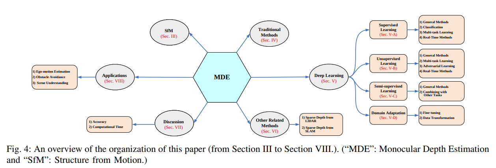

# 2021年1115-1119 arXiv SLAM相关新文一览

本周SLAM相关文章共16篇，其中已开源3篇，已注明待开源2篇。

> 注：
>
> 1、arXiv 上提交的、未注明发表或被accepted的新文章**并未经过完整的同行评议**，**其内容真实性无法保证**，请小伙伴们阅读时务必注意；
>
> 2、本文仅作为我监督自己的约束手段，目的并不在于深入理解论文具体创新思想和算法原理，仅停留在非常浅的层次。每篇论文后均附有下载链接，arXiv的文章全球开放、免费访问，感兴趣的小伙伴可以自行下载阅读；
>
> 3、文章同步更新于Github仓库：https://github.com/DreamWaterFound/SLAM-NewsPaper 欢迎 watch 和 star；
>
> 4、出于个人兴趣，可能会整理一些和SLAM没有直接相关、但可服务于SLAM的相关工作，例如部分深度估计、特征表示、地图表示、语义分割工作和自主导航、环境探索等；
>
> 5、由于能力水平有限，我对于理解、阐述可能不到位的地方，还望各位大佬们不吝赐教。

- **Autonomous Teamed Exploration of Subterranean Environments using Legged and Aerial Robots - 使用足式和空中机器人自主组队探索地下环境**

  关键词：**开源** 足式机器人+飞行机器人编队探索 地下环境探索 路径规划 共享地图 多机器人协作

  摘要：本文提出了一种利用腿式和空中机器人自主组队探索地下环境的新策略。针对地下环境，如洞穴网络和地下矿井，往往涉及复杂、大规模和多分支的拓扑结构，而其中的无线通信可能特别具有挑战性。这项工作围绕一个机载的、允许弹性长期自治的探索路径规划器，构建了一个多机器人对协同框架。机载路径规划器是足式机器人和飞行机器人的统一，能够在陡坡和不同几何形状的环境中导航。当通信链路可用时，团队中的每个机器人共享到一个集中位置的子地图，在这个位置上，多机器人协调框架确定了探索空间的全局边界，以通知每个系统它在哪里应该重新定位才可最好地继续其任务。该策略通过在瑞士一个地下矿井内的实地部署进行了验证，使用一个足式机器人和一个飞行机器人共同探索45分钟；以及在模拟器中使用三个系统进行了更长时间的研究。

  发表信息：Submitted to the IEEE International Conference on Robotics and Automation, 2022

  开源代码：https://github.com/ntnu-arl/gbplanner_ros (作为2.0版本发布)

  下载链接：https://arxiv.org/pdf/2111.06482v1.pdf

  

  

  

  

- **Observation Contribution Theory for Pose Estimation Accuracy - 位姿估计精度的观测贡献理论**

  关键词：基于激光SLAM的研究 环境观测到哪些信息对最终位姿估计精度帮助最大

  摘要：姿态估计精度的提高是目前移动机器人的基本问题。本研究旨在改进观测的使用，以提高精度。特征点的选择影响姿态估计的精度，导致观测贡献如何影响系统的问题。据此，分析了信息对姿态估计过程的贡献。建立了不确定性模型、灵敏度模型和贡献理论，给出了各残差项贡献的计算方法。所提出的选择方法已被理论证明能够获得全局统计最优。在人工数据仿真中对该方法进行了测试，并与KITTI基准进行了比较。实验结果表明，与ALOAM和MLOAM相比，该方法具有较好的效果。采用不同扫描方式的激光雷达传感器，在室内和室外的激光雷达测程和激光雷达惯性测程中实现了该算法，证明了该算法在提高位姿估计精度方面的有效性。由此推断出两个激光扫描传感器的新结构。该配置对先前地图中的三维姿态定位有效，并得到厘米级的实验结果。

  下载链接：https://arxiv.org/pdf/2111.07723v1.pdf

  

  

  

  

  

- **TANDEM: Tracking and Dense Mapping in Real-time using Deep Multi-view Stereo - TANDEM：利用深度多视图立体匹配进行实时跟踪和稠密建图**

  关键词：**开源** 基于DL 稠密多视图的深度估计  TSDF 实时三维重建 关键帧滑动窗口

  摘要：在本文中，我们提出了一个实时单目跟踪和稠密建图框架。对于姿态估计，TANDEM基于关键帧的滑动窗口进行BA调整。为了增强鲁棒性，我们提出了一种新的跟踪前端，该前端使用由稠密深度估计增量构建的全局模型渲染的深度图来执行稠密的直接法图像对齐。为了预测稠密的深度图，我们提出了级联视图聚合MVSNet （Cascade View-Aggregation MVSNet，CVA-MVSNet），它利用整个活动关键帧窗口，通过分层构造具有自适应视图聚合的3D成本量来平衡关键帧之间的不同基线。最后，将预测的深度图融合为一致的全局图，以TSDF体素网格表示。我们的实验结果表明，TANDEM在摄像机跟踪方面优于其他先进的传统和基于学习的单目VO方法。此外，TANDEM还展示了最先进的实时三维重建性能。

  发表信息：CoRL 2021

  项目网页：https://go.vision.in.tum.de/tandem

  开源代码：https://github.com/tum-vision/tandem

  下载链接：https://arxiv.org/pdf/2111.07418v1.pdf

  

  

  

  

  

- **Towards Real-Time Monocular Depth Estimation for Robotics: A Survey -  机器人单目实时深度估计的研究进展**

  关键词：综述 单目深度估计

  摘要：单目深度估计（Monocular Depth Estimation，MDE）为自主驾驶和机器人活动（如自我运动估计、避障和场景理解）的重要组成部分，已经引起了计算机视觉和机器人界的广泛关注。在过去的几十年里，已经发展了大量的方法。然而，就我们所知，并没有对MDE进行全面的调查文献。本文旨在通过回顾1970年至2021年间发表的197篇相关文章来弥合这一差距。特别是，我们提供了MDE的全面调研，涵盖了各种方法，介绍了流行的性能评估指标，并总结了公共可用的数据集。我们还总结了一些有代表性的方法的可用开源实现，并比较了它们的性能。此外，本文还综述了MDE在机器人一些重要任务中的应用。最后，我们总结了本文，并提出了未来的研究方向。本调查旨在帮助、指引读者在这一研究领域中开展自己的工作。

  下载链接：https://arxiv.org/pdf/2111.08600v1.pdf

  

  

  

  

- **2.5D Vehicle Odometry Estimation - 2.5D 车辆里程估计**

  关键词：底盘模型扩充 轮式里程计 偏航率传感器

  摘要：众所周知，在ADAS应用中，需要对载具的姿态进行良好的估计。本文提出了一种2.5D里程计，将由偏航率传感器和四轮速度传感器推导出来的平面里程计，用一个悬架的线性模型加以扩充。虽然平面里程计的核心是一个偏航率模型并已经在相关文献中得到了充分的研究，但我们通过对输入信号拟合二次曲线来增强这一点，从而实现插值、外推和车辆位置的更精细集成。我们通过将DGPS+IMU对轨迹作为参考，实验结果表明与现有方法相比，该模型提供了高精度的里程估算。利用传感器返回车辆参考点高度随悬架配置变化的变化，我们定义了车辆悬架的平面模型，从而扩充了里程计模型。我们提出了一个实验框架和评价标准，用来评价里程计的优度，并与现有的方法进行比较。这个里程计模型被设计用于支持低速环视相机系统。因此，我们展示了一些在计算机视觉应用中使用本文方法得到性能提升的结果。

  发表信息：Journal-ref：IET Intelligent Transport Systems, 2020

  下载链接：https://arxiv.org/pdf/2111.08398v1.pdf

  

  

  

  

- **Hierarchical Topometric Representation of 3D Robotic Maps - 三维机器人地图的分层拓扑表示**

  关键词：三维拓扑地图 分层

  摘要：在本文中，我们提出了一种从三维点云生成层次的、体积的拓扑图的方法。在我们的地图中有三个基本的层次层：storey - region - volume​。我们方法的优点体现在输入和输出两方面。在输入方面，我们接受多层点云、倾斜屋顶或天花板的建筑结构。在输出方面，我们可以使用不同维度的度量信息生成适合不同机器人应用的结果。该算法通过从3D体素占有地图生成volumes来进行体积表示。然后我们添加passages（volumes之间的连接），将小的volumes合并成大的region，并使用2D分割方法以获得更好的拓扑表示。我们在几个公开可用的数据集上评估了我们的方法，这些实验突出了我们方法的优点。

  发表信息：Autonomous Robots (2021): 1-17

  下载链接：https://arxiv.org/pdf/2111.08283v1.pdf

  

  

  

  

  

- **DA-LMR: A Robust Lane Markings Representation for Data Association Methods - DA-LMR：一种用于数据关联方法的鲁棒车道标记表示**

  关键词：车道线表示 数据关联 RANSAC的改进

  摘要：虽然完整定位方法在文献中得到了广泛的研究，但其数据关联和数据表示的子过程往往被忽视。然而，两者都是最终姿态估计的关键部分。在这项工作中，我们提出了DA-LMR （Delta-Angle Lane Markings Representation），这是一种在定位方法下的鲁棒数据表示方法。我们提出了一种车道标记表示，编码了曲线在每个点的变化，并将该信息包含在额外的维度中，从而提供更详细的数据几何结构描述。我们还提出了一种数据关联方法DC-SAC （Distance-Compatible Sample Consensus）。这是RANSAC的一个启发式版本，它通过距离兼容性限制极大地减少了假设空间。我们将所提出的方法与一些最新的数据表示和数据关联方法在不同的噪声场景下进行了比较，DA-LMR和DC-SAC产生了效果最好的组合，在标准偏差为0.5m的噪声数据中，精度达到98.1%，召回率达到99.7%。

  投稿信息：Under review in ICRA 2022

  下载链接：https://arxiv.org/pdf/2111.09230v1.pdf

  

  

  

  

- **The Unified Mathematical Framework for IMU Preintegration in Inertial-Aided Navigation System - 惯性辅助导航系统中IMU预积分的统一数学框架**

  关键词：IMU预积分 惯性辅助的导航

  摘要：本文提出了惯性导航系统在不同坐标系下、不同运动条件下的惯性测量单元预积分的统一数学框架。导航状态被精确离散为三部分：局部增量、全局状态和全局增量。全局增量可以在 local geodetic navigation frame 和 earth-centered-earth-fixed frame 等不同框架中计算。在不同的假设下，可以根据载体的运动和IMU的等级来计算局部增量（即IMU预积分），从而使不同环境下的惯性组合导航系统在线状态估计更准确、更方便。

  下载链接：https://arxiv.org/pdf/2111.09100v1.pdf

- **Multi-Mobile Robot Localization and Navigation based on Visible Light Positioning - 基于可见光定位的多移动机器人定位导航**

  关键词：可见光定位 

  摘要：本文研究了基于可见光定位(VLP)的多移动机器人导航。实验表明，VLP（Visible Light Positioning，可见光导航）能够准确定位机器人的导航位置。

  下载链接：https://arxiv.org/pdf/2111.09050v1.pdf

  演示视频：https://www.bilibili.com/video/BV1Df4y1T7u3?spm_id_from=333.999.0.0

  

  

- **ARKitScenes -- A Diverse Real-World Dataset For 3D Indoor Scene Understanding Using Mobile RGB-D Data - ARKitScenes：一种使用移动RGB-D数据理解3D室内场景的多样化真实数据集**

  关键词：RGB-D数据集 AR

  摘要：场景理解是一个活跃的研究领域。商业深度传感器如Kinect在过去的几年里已经发布了若干个RGB-D数据集，这催生了3D场景理解的新方法。最近，随着苹果公司在 iPad 和 iPhone 上推出激光雷达传感器，数百万人可以通过他们常用的设备获取高质量的RGB-D数据，这为计算机视觉社区和应用程序开发者开启了一个全新的场景理解时代。场景理解的基础研究和机器学习的进步现在可以影响人们的日常体验，然而将这些场景理解方法转化为现实体验需要额外的创新和开发。在本文中，我们介绍了ARKitScenes。这不仅是第一个由现在广泛使用的深度传感器捕获的RGB-D数据集，而且据我们所知，它也是发布的最大的室内场景理解数据。除了来自移动设备的原始和处理过的数据，ARKitScenes还包括使用固定激光扫描仪捕获的高分辨率深度地图，以及手动标记的面向3D的家具分类包围盒。我们进一步分析了数据对下游两个任务的有用性：3D目标检测；颜色引导的深度上采样。我们证明，我们的数据集可以帮助拓展现有的最先进的方法，它引入了新的挑战、更好地代表现实世界的场景。

  下载链接：https://arxiv.org/pdf/2111.08897v1.pdf

  注：这篇数据集的目的更多是为了进行AR相关应用（场景理解），对于SLAM/VO等方面没有进行针对性地设计，但对于稠密建图、回环检测、场景识别方向的研究也许有一定启发。

  

  

  

  

- **Probabilistic Spatial Distribution Prior Based Attentional Keypoints Matching Network - 基于概率空间分布先验的注意关键点匹配网络**

  关键词：基于深度学习的特征点匹配 IMU辅助特征匹配 注意力机制 定义关键点匹配损失 图神经网络 传感器融合

  摘要：关键点匹配是许多与图像相关的应用程序的关键组成部分，如图像拼接、视觉SLAM等。无论是基于手工的还是最近出现的基于深度学习的关键点匹配方法，都仅仅依赖关键点和局部特征，而忽略了上述应用中其他可用的传感器，如惯性测量单元（IMU）。在本文中，我们证明了从IMU集成的运动估计可以利用关键点在图像之间的空间分布先验。为此，提出了注意力的概率视角，将空间分布自然地整合到注意力的图神经网络中。在空间分布先验的帮助下，可以减少网络对隐藏特征建模的工作量。此外，我们提出了关键点匹配网络的投影损失，使匹配和非匹配关键点之间具有平滑的边缘。在视觉SLAM数据集上的图像匹配实验表明了该方法的有效性和有效性。

  下载链接：https://arxiv.org/pdf/2111.09006v1.pdf

  

  

  

  

  

  

- **HARA: A Hierarchical Approach for Robust Rotation Averaging - HARA：一种鲁棒旋转平均的分层方法**

  关键词：**待开源** 旋转平均方法 分层 生成树

  摘要：我们提出了一种新的多层旋转平均方法，称为HARA。我们的方法基于三重支撑层次递增初始化旋转图。其核心思想是通过优先考虑支持度较强的边，逐步添加支持度较弱和较少的边来构建生成树。这降低了在生成树中添加离群值的风险。因此，我们得到一个鲁棒的初始解，使我们能够在非线性优化之前过滤离群值。通过最小的修改，我们的方法还可以集成有效的2D-2D关联数量的知识。我们对合成和真实数据集进行了广泛的评估，并展示了本文方法具有SOTA的结果。

  下载链接：https://arxiv.org/pdf/2111.08831v1.pdf

  

  

  

- **Nonlinear Intensity Sonar Image Matching based on Deep Convolution Features - 基于深卷积特征的非线性强度声纳图像匹配**

  关键词：深度学习 声呐图像匹配 AUV 水下机器人应用 相位信息 局部/全局相似性

  摘要：在深海探测领域，声纳是目前唯一有效的远距离传感设备。复杂的水下环境，如噪声干扰、低目标强度或背景动态等，给声纳成像带来了许多负面影响。其中非线性强度问题极为普遍，这也被称为声成像的各向异性，即当AUV携带声纳从不同角度检测同一目标时，有时图像对之间的强度差非常大，这使得传统的匹配算法几乎无效。图像匹配是导航、定位、测绘等综合任务的基础，因此获得足够鲁棒和足够准确的匹配结果非常有价值。本文提出了一种基于相位信息和深度卷积特征的组合匹配方法，它有两个突出的优点：一是利用深度卷积特征度量声纳图像局部和全局位置的相似性；二是在声纳图像的关键目标位置进行局部特征匹配。该方法不需要复杂的人工设计，以近端到端方式完成了非线性声纳图像的匹配任务。最后本文对水下机器人捕获的深海声纳图像进行了特征匹配实验，结果表明，该方法具有良好的匹配精度和鲁棒性。

  下载链接：https://arxiv.org/pdf/2111.08994v1.pdf

  

  

  

  

- **Visual Navigation Using Sparse Optical Flow and Time-to-Transit - 基于稀疏光流和传输时间的视觉导航**

  关键词：单目 光流 视觉导航 time-to-transit

  摘要：通过仿生，我们开展并描述了使用单目相机采集的图像，利用视觉的方式为移动机器人对导航提供可靠的信号。这项工作的灵感来自Lee和Reddish的一篇经典论文（[Nature, 1981](https://doi.org/10.1038/293293a0)），这篇论文概述了潜水的海鸟所追求的一种行为策略，该策略基于一种叫”时间-接触（time-to-contact）”的视觉线索。一个和time-to-transit密切相关的概念被定义为tau（希腊字母），表明，基于单目相机感知tau的idealized steering laws能够可靠而稳健地在各种空间中引导移动车辆，在这些空间中，感知到的特征在墙壁和环境中的其他物体上，提供了足够的视觉线索(没太看懂这边想表达啥意思，感觉就是环境纹理丰富有助于车辆段定位和导航引导呗)。本论文有两个贡献，一方面它为基于视觉的鲁棒转向控制提供了一个简单的理论；另一方面它展示了在ROS的Gazebo模拟器中，以及实际场景中一个配备摄像头的Jackal机器人，如何在理论指导下实现鲁棒视觉导航的。就我们所知，下面描述的实验是第一个展示基于tau的视觉导航的实验。

  (这篇摘要看不太懂)

  下载链接：https://arxiv.org/pdf/2111.09669.pdf

  

  

  

  

- **Lidar with Velocity: Motion Distortion Correction of Point Clouds from  Oscillating Scanning Lidars - 具有速度的激光雷达：摆动扫描激光雷达点云运动畸变校正**

  关键词：**开源** MEMS/固态激光雷达  运动畸变 相机+激光雷达 视觉辅助 卡尔曼滤波 运动目标跟踪

  摘要：移动物体引起的激光雷达点云畸变是自动驾驶中的一个重要问题，最近随着具有来回扫描模式的新型激光雷达的出现，对点云畸变的要求更加苛刻。准确估计运动物体的速度不仅可以提供跟踪能力，而且可以通过更准确的运动物体描述来纠正点云畸变。由于激光雷达测量的是飞行时间距离，但角度分辨率较低，因此径向测量精度较高，但缺乏角度测量。另一方面，相机提供了密集的角度分辨率。本文提出了一种基于高斯的激光雷达与相机融合算法，用于估计激光雷达的全速度和校正激光雷达畸变。提出了一种概率卡尔曼滤波框架，用于跟踪运动目标，估计其速度，同时校正点云畸变。该融合框架在实际道路数据上进行了评价，结果表明，该融合方法优于传统的基于icp和仅基于点云的融合方法。完整的工作框架是开源的(https://github.com/ISEE-Technology/lidar-with-velocity)，以加速新兴激光雷达的采用。

  下载链接：https://arxiv.org/pdf/2111.09497.pdf

  

  

  

  

  

- **Temporally Consistent Online Depth Estimation in Dynamic Scenes - 动态场景中的时间一致在线深度估计**

  关键词：**待开源** 时间一致的深度估计 动态场景（环境中物体运动） 针对在线应用 逐像素SE3变换预测 

  摘要：时间一致的深度估计对于增强现实等实时应用至关重要。虽然立体深度估计已经得到了大量的关注，并在逐帧基础上进行了改进，但在保持帧间时间一致性方面的工作相对较少。事实上，根据我们的分析，目前的立体深度估计技术仍然存在时间一致性差的问题。在动态场景中，由于物体和相机运动的并发性，稳定时间深度是一个挑战。在在线环境中，因为只有过去的帧是可用的，这个过程会进一步恶化。本文提出了一种在在线场景中生成时间一致的动态场景深度估计的技术。我们的网络通过新颖的运动和融合网络增强了当前的每帧立体网络。运动网络通过预测逐像素SE3变换来解释物体和摄像机的运动。该融合网络通过对当前和以前的预测进行加权回归，提高了预测的一致性。我们在不同的数据集（合成的、室外的、室内的和面向医疗应用的）上进行了充分的实验。在zero-shot泛化和domain fine-tuning方面，我们证明提出的方法无论是定量还是定性评估，在时间稳定性和每帧精度方面优于其他方法。代码将开源。
  
  下载链接：https://arxiv.org/pdf/2111.09337.pdf

  

  

  

