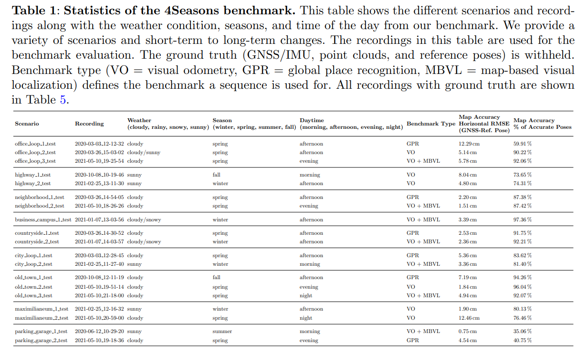

# 2023年0102-0106 arXiv SLAM相关新文一览

本周SLAM相关文章共 10 篇，其中已开源 2 篇，已注明待开源 1 篇。

> 注：
>
> 1、arXiv 上提交的、未注明发表或被accepted的新文章**并未经过完整的同行评议**，**其内容真实性无法保证**，请小伙伴们阅读时务必注意；
>
> 2、本文仅作为我监督自己的约束手段，目的并不在于深入理解论文具体创新思想和算法原理，仅停留在非常浅的层次。每篇论文后均附有下载链接，arXiv的文章全球开放、免费访问，感兴趣的小伙伴可以自行下载阅读；
>
> 3、文章同步更新于Github仓库：https://github.com/DreamWaterFound/SLAM-NewsPaper 欢迎 watch 和 star；
>
> 4、出于个人兴趣，可能会整理一些和SLAM没有直接相关、但可服务于SLAM的相关工作，例如部分深度估计、特征表示、地图表示、语义分割工作和自主导航、环境探索等；
>
> 5、由于能力水平有限，我对于理解、阐述可能不到位的地方，还望各位大佬们不吝赐教。

- **An Enhanced LiDAR-Inertial SLAM System for Robotics Localization and Mapping - 为机器人定位和地图构建而增强的激光雷达-惯性SLAM系统**

关键词：激光雷达+惯性传感器 粒子群滤波 回环检测 支持类 Livox 和机械旋转式激光雷达

摘要：基于LiDAR和惯性传感器的定位与地图构建对于无人地面车辆的相关应用具有重要意义。在这项工作中，我们开发了一种改进的用于无人地面车辆的LiDAR-惯性定位和地图绘制系统，该系统适用于多用途搜索和救援应用。与现有的基于LiDAR的定位和地图绘制系统（例如LOAM）相比，我们有两个主要贡献：一是提高基于粒子群滤波的LiDAR SLAM的鲁棒性，二是采用闭环方法进行全局优化，提高整个系统的定位精度。实验结果表明，该方法提高了LiDAR SLAM系统的定位精度和鲁棒性。最后，在香港科学园以及其他室内外真实复杂测试环境下进行了系统的实验测试，验证了该方法的有效性和高效性。实验结果表明，该系统具有较高的精度、鲁棒性和效率。该系统对于未知环境下无人地面车辆的定位和地图绘制具有重要意义。

发表信息：ICCA 2022 (Oral)

下载链接：https://arxiv.org/pdf/2212.14209v1.pdf

- **HPointLoc: Point-based Indoor Place Recognition using Synthetic RGB-D Images - HPointLoc： 基于点的、使用合成RGB-D图像的室内场景识别**

关键词：**开源** 回环检测 合成数据集 RGB-D 场景识别 

摘要：本文提出了一个新的数据集HPointLoc，专门用于探索室内环境下的视觉位置识别和SLAM中的回环检测能力。当一个带有RGB-D摄像机的机器人可以以不同的角度驶过同一个地方（"点"）时，回环检测这个子任务尤其重要。该数据集基于流行的 Habitat 模拟器，在该模拟器中，可以使用自己的传感器数据和开放数据集（如Matterport3D）生成真实感室内场景。为了研究HPointLoc数据集上求解场景识别问题的主要阶段，本文提出了一种新的模块化方法PNTR. 该算法首先利用Patch-NetVLAD方法进行图像检索，然后提取关键点，并利用R2D2、LoFTR或SuperPoint with SuperGlue进行匹配，最后利用TEASER ++进行相机姿态优化。这种对场景识别问题的解决方案目前还有没有相关发表的研究工作。PNTR方法在HPointLoc数据集上显示出最好的质量指标，并且在无人驾驶车辆的定位系统中具有很高的实际使用潜力。本文提出的数据集和算法框架对公众开放。

发表信息：ICONIP 2022

开源代码/数据：https://github.com/metra4ok/HPointLoc

下载链接：https://arxiv.org/pdf/2212.14649v1.pdf

- **A Combined Approach Toward Consistent Reconstructions of Indoor Spaces Based on 6D RGB-D Odometry and KinectFusion - 基于6DOF RGB-D里程计和 KinectFusion的室内一致重建组合方法**

关键词：RGB-D视觉里程计 三维地图构建 关联KinectFusion

摘要：本文提出了一种6DOF的RGB-D测距方法，通过在RGB和深度图像平面上的关键点提取和特征匹配来确定连续RGB-D帧之间的相对相机姿态。此外，我们将估计出的位姿反馈给高精度的KinectFusion算法，该算法使用快速的ICP（Iterative Closest Point，迭代最近点）来微调帧间的相对位姿，并将深度数据融合到全局隐式曲面中。接着本文在Sturm等公开的RGB-D SLAM基准数据集上对该方法进行了评估，实验结果表明，仅基于视觉里程计和 KinectFusion 的重建方法优于现有的RGB-D SLAM系统精度。此外，我们的算法输出一个现成的Mesh而不需要任何后处理步骤，这非常适合创建三维虚拟世界。

发表信息：ACM Trans. Intell. Syst., vol. 6, no. 2, pp. 14:1-10, 2015

下载链接：https://arxiv.org/pdf/2212.14772v1.pdf

- **An Event-based Algorithm for Simultaneous 6-DOF Camera Pose Tracking and Mapping - 面向同时六自由度相机位姿追踪和建图的基于事件的算法**

关键词：事件相机与惯性测量结合

摘要：与普通相机相比，动态视觉传感器或事件相机可以根据每个像素位置的强度变化异步输出紧凑的视觉数据。在本文中，我们研究了视觉SLAM技术在这些新型传感器中的应用。为此，本文处理自适应选择的事件窗口中的信息以形成运动补偿的图像，这些图像然后被用于重建场景并估计相机的六自由度姿态。我们还在仅使用事件数据的里程计版本基础上，提出了一个同时使用事件数据和惯性测量的算法版本。我们在两个公开的事件相机数据集上，结合数据集提供的位姿真值，使用不同的参数配置测试了我们算法。我们还将所提出的事件惯性 pipeline 的结果与现有技术的结果进行了比较，并表明只要地图估计是可靠的，它就可以产生近似甚至更准确的结果。

下载链接：https://arxiv.org/pdf/2301.00618v1.pdf

  

- **Rethinking Rotation Invariance with Point Cloud Registration - 对点云配准问题中旋转不变性的重新思考**

关键词：**开源** 点云配准 Transformer

摘要：近对三维点云旋转不变性的研究致力于设计旋转不变性特征描述子或学习对象语义对齐的规范空间。对学习框架不变性的检验很少被研究。在这项工作中，我们回顾了点云配准中的旋转不变性，并提出了一个有效的旋转不变性学习框架，该框架通过三个连续的阶段进行，即旋转不变性形状编码、对齐特征集成和深度特征配准。我们首先对相对于在不同尺度上定义的参考帧构造的形状描述符进行编码，局部面片和全局拓扑，以生成旋转不变的潜在形状代码。在整合阶段，我们提出对齐整合转换器，借由整合在形状码内建立的点式自我与交叉关系，产生一个可辨识的特征表示。同时，我们在参考坐标系之间采用刚性变换来对齐形状编码，以保证不同尺度下的特征一致性。最后，将深度集成特征配准到两个旋转不变的形状码以最大化特征相似性，从而保持集成特征的旋转不变性并从形状码中隐式提取共享语义信息。在三维形状分类、零件分割和检索任务上的实验结果证明了该方法的可行性。

发表信息：AAAI 2023

项目主页： https://rotation3d.github.io/

开源代码：https://github.com/Crane-YU/rethink_rotation

下载链接：https://arxiv.org/pdf/2301.00149v1.pdf

- **Class-Continuous Conditional Generative Neural Radiance Field - 类连续的条件生成神经辐射场**

关键词：NeRF

摘要：3D图像合成除了生成具有精细细节的高分辨率图像外，还关注保持空间一致性。近年来，神经辐射场（NeRF）被引入到合成新视角的研究中，具有计算成本低、性能优越等优点。虽然已有一些工作对生成式NeRF进行了研究并取得了显著的成果，但它们不能处理生成过程中的条件和连续特征操作。在本文中，我们介绍了一种新的模型，称为类连续条件生成NeRF（$\text{C}^{3}$ G-NeRF），它可以通过将条件特征投影到生成器和鉴别器，来合成条件操作的真实感3D一致图像。本文使用AFHQ、CelebA和Cars三个图像数据集评价了提出的$\text{C}^{3}$G-NeRF。结果表明，该模型在条件特征处理中表现出了良好的三维一致性、精细的细节和平滑的插值。例如，$\text{C}^{3}$G-NeRF在具有$\text{128}^{2}$分辨率的3D感知人脸图像合成中表现出7.64的Fr 'echet初始距离（FID）。此外，我们提供了每类数据集生成的3D感知图像的FID，因为可以使用$\text{C}^{3}$G-NeRF合成类条件图像。

发表信息：AAAI 2023

下载链接：https://arxiv.org/pdf/2301.00950v1.pdf

- **4Seasons: Benchmarking Visual SLAM and Long-Term Localization for Autonomous Driving in Challenging Conditions - 4Seasons: 自动驾驶在挑战条件下的基准视觉SLAM和长期定位**

关键词：数据集 长期定位问题

摘要：本文基于大规模4Seasons数据集，提出了一种新的视觉SLAM和长期定位基准，用于挑战性条件下的自动驾驶。所提议的基准提供了由季节变化以及不同的天气和照明条件引起的剧烈外观变化。尽管在条件相似的小规模数据集上推进视觉SLAM取得了显著进展，但目前仍缺乏代表自动驾驶真实场景的统一基准。我们引入了一个新的统一基准，用于联合评估视觉里程计、全局位置识别和基于地图的视觉定位性能，这对于在任何条件下成功实现自动驾驶至关重要。这些数据已经收集了一年多，在九个不同的环境中产生了300多公里的记录，范围从多层停车场到城市（包括隧道）到农村和公路。我们提供全局一致的参考位姿，通过融合直接法的立体视觉+惯性的VIO和RTK GNSS获得高达厘米级的精度。我们评估了几种最先进的视觉里程计和视觉定位基线方法的性能，并分析了它们的特性。实验结果为现有方法提供了新的思路，并显示了未来研究的潜力。

项目主页：https://www.4seasons-dataset.com/

介绍视频：https://youtu.be/Vn84qyTGx7U

下载链接：https://arxiv.org/pdf/2301.01147v1.pdf

- **BS3D: Building-scale 3D Reconstruction from RGB-D Images - BS3D：基于RGB-D图像的建筑物尺度三维重建**

关键词：RGB-D 三维重建 使用主动近红外图像 数据集

摘要：现在已经有用于同时定位和地图绘制（SLAM）和相关问题的各种数据集。这些数据集通常包括的环境比较小，具有不完整的真值，或者缺乏重要的传感器数据，例如深度和红外图像。我们提出了一个易于使用的框架，用于获取建筑规模的三维重建使用消费者深度相机。与复杂和昂贵的采集设置不同，我们的系统支持众包，这可以极大地有利于数据密集型算法。与类似系统相比，我们利用原始深度图进行里程计算和回环检测求精，从而获得更好的重建效果。我们获取了建筑物尺度的3D数据集（BS3D），并通过训练改进的单目深度估计模型来证明其价值。作为一个独特的实验，我们基准视觉惯性里程计方法使用彩色和主动红外图像。

下载链接：https://arxiv.org/pdf/2301.01057v1.pdf

- **LunarNav: Crater-based Localization for Long-range Autonomous Lunar Rover Navigation - LunarNav: 基于环形山的大范围月球车自主定位导航**

关键词：太空探测器 月面SLAM

摘要：阿耳忒弥斯计划需要机器人和载人月球车进行资源勘探和开发、设施建设和维护以及人类探索。这些漫游车必须支持从基地营地到10公里（km）的导航。月球科学漫游车任务概念（Endurance-A），已被新的十年调查推荐为月球发现和探索计划中最优先的中型任务，并将需要在南极-艾特金（South PoleAitkin，SPA）盆地内穿越约2000 km，在下行链路的停靠站之间单独行驶数公里。这些漫游车的任务场景需要提供机载、自主、全局定位（即绝对定位）的功能。然而，行星漫游车至今没有机载的全局定位能力；他们仅通过在每次驾驶期间整合轮式里程计、视觉里程计和惯性测量的组合来跟踪相对于每次驾驶开始的位置，也就是使用的是相对定位。在本文中，我们总结了 LunarNav 项目的最新进展，在该项目中，我们开发了算法和软件，使月球车能够估计其在月球上的全局位置和航向，目标性能是在阳光照射区域，位置误差小于5米，航向误差小于3度（3 σ）。这将通过探测火星车附近的陨石坑并将其与从轨道绘制的已知陨石坑数据库进行匹配来自动实现。总体技术框架由三个主要部分组成：1）陨石坑检测，2）陨石坑匹配，以及3）状态估计。在以前的工作中，我们为三种不同的传感模态开发了陨石坑检测算法。我们的结果表明，在白天操作期间，误差小于5 m的漫游者定位是非常可能的。

发表信息：IEEE Aerospace Conference 2023

下载链接：https://arxiv.org/pdf/2301.01350v1.pdf

- **A Probabilistic Framework for Visual Localization in Ambiguous Scenes - 歧义场景西安的概率视觉定位框架**

关键词：**待开源** 视觉定位 基于概率 针对会产生歧义的场景

摘要：视觉定位允许自主机器人在失去对自身姿态的跟踪时，通过匹配当前观测值和过去观测值来重新定位。然而，歧义的场景对这样的系统提出了挑战，因为可以从许多不同的、同样可能的相机姿态观察重复结构，这意味着产生单个最佳姿态假设是不够的。在这项工作中，我们提出了一个概率框架，为一个给定的图像预测其相机姿态的任意形状的后验分布。我们通过使用变分推理的摄像机姿态回归的新公式来实现这一点，变分推理允许从预测分布中采样。该方法在模糊场景中的定位性能优于现有方法。

代码&数据：https://github.com/efreidun/vapor （但是 2023/01/08 无法访问此链接）

下载链接：https://arxiv.org/pdf/2301.02086v1.pdf

