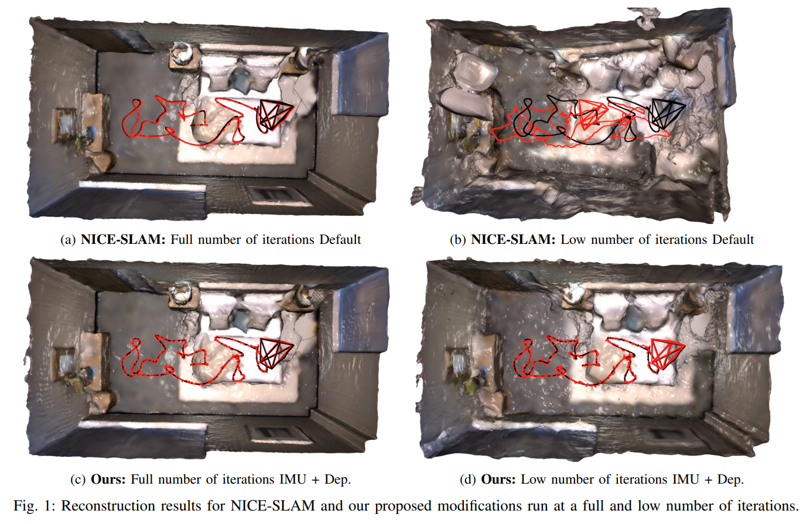
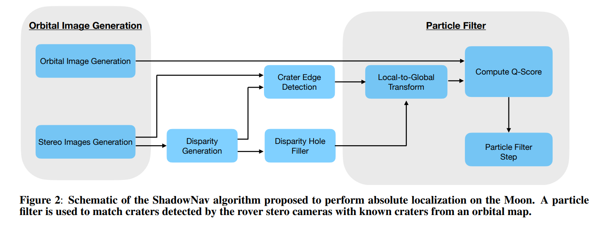
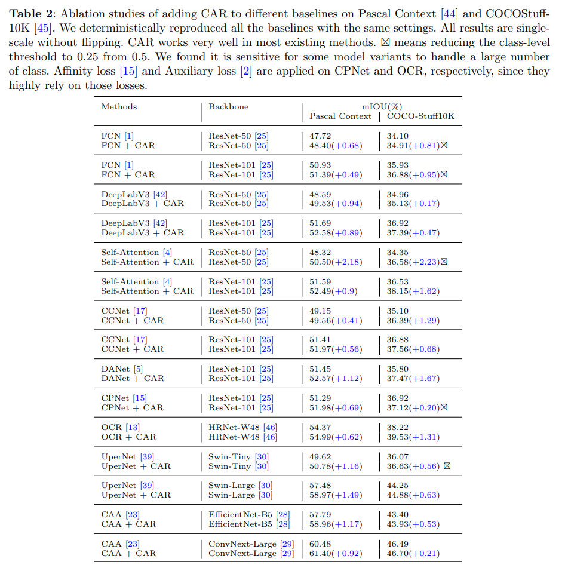
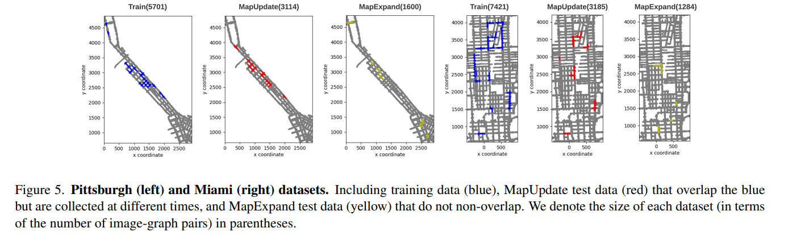
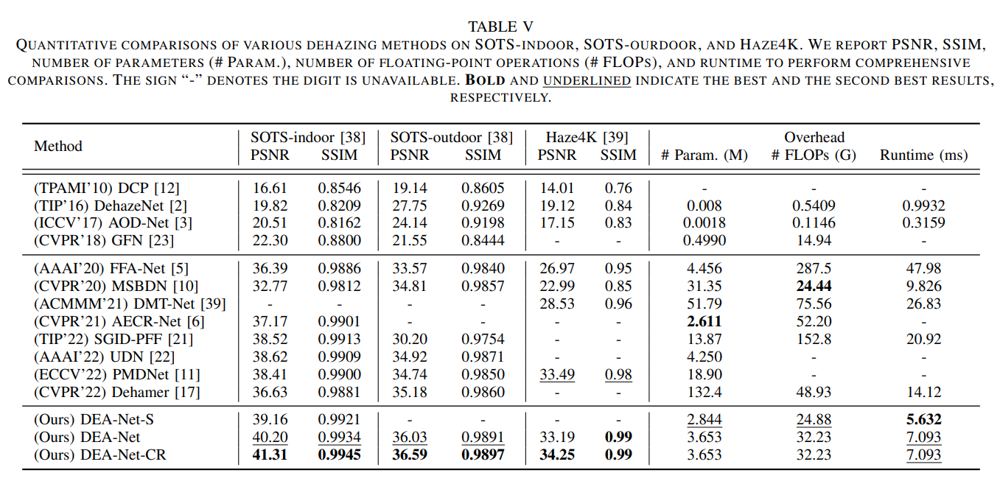

# 2023年 0109-0113 arXiv SLAM相关新文一览

本周SLAM相关文章共 12 篇，其中已开源 3 篇，已注明待开源 1 篇。

> 注：
>
> 1、arXiv 上提交的、未注明发表或被accepted的新文章**并未经过完整的同行评议**，**其内容真实性无法保证**，请小伙伴们阅读时务必注意；
>
> 2、本文仅作为我监督自己的约束手段，目的并不在于深入理解论文具体创新思想和算法原理，仅停留在非常浅的层次。每篇论文后均附有下载链接，arXiv的文章全球开放、免费访问，感兴趣的小伙伴可以自行下载阅读；
>
> 3、文章同步更新于Github仓库：https://github.com/DreamWaterFound/SLAM-NewsPaper 欢迎 watch 和 star；
>
> 4、出于个人兴趣，可能会整理一些和SLAM没有直接相关、但可服务于SLAM的相关工作，例如部分深度估计、特征表示、地图表示、语义分割工作和自主导航、环境探索等；
>
> 5、由于能力水平有限，我对于理解、阐述可能不到位的地方，还望各位大佬们不吝赐教。

- **Improving Self-Consistency in Underwater Mapping through Laser-Based Loop Closure (Extended) - 利用激光回环提高水下建图的自我一致性(扩展)**

关键词：激光雷达 水下机器人

摘要：为监测海底环境和基础设施的变化，需要精确、自我一致的测深图。这些地图越来越多地由水下航行器收集，为了实现测绘需要精确的航行器导航解决方案。用于水下航行器的商用即开即用（Commercial Off-The-Shelf，COTS）导航解决方案通常依赖于外部声传感器来进行定位，然而勘测级声传感器部署昂贵，同时也限制了水下航行器的作业范围。来自同时定位和建图（Simultaneous Localization And Mapping）领域的技术，特别是闭环检测，相对于航位推算的结果可以提高导航解的质量，但是难以集成到COTS导航系统中。本文提出了一种方法，通过将闭环检测结果平滑地整合到由商业水下导航系统生成的状态估计中，来提高测深图的自我一致性。集成过程使用白噪声加速度运动先验来完成，无需访问原始传感器测量值或专有模型。本文在模拟和实际场景数据集，包括在威尔顿，安大略省，加拿大水下沉船的三维扫描基础上开展了实验，展示了本文方法带来的地图自我一致性的改善。

发表信息：ICCA 2022 (Oral)

下载链接：https://arxiv.org/pdf/2212.14209v1.pdf

- **CyberLoc: Towards Accurate Long-term Visual Localization - CyberLoc: 面向准确性的长期视觉定位**

关键词：视觉定位 长期定位问题 三维重建 

摘要：本技术报告介绍了CyberLoc，这是一种基于图像的视觉定位pipeline，用于在具有挑战性的条件下进行稳健和准确的长期位姿估计。CyberLoc所提出的方法包括顺序连接的四个模块。第一个模块中，应用建图模块来建立场景的精确3D地图，如果在不同条件下存在多个参考序列，则每个参考序列对应一个地图。第二个模块中执行基于单个图像的定位pipeline（检索-匹配-PnP）以估计每个检索图像的 6 自由度的相机位姿，每个3D地图均有一个对应的位姿。第三个模块中使用了一致性集最大化模块（consensus set maximization module）来过滤掉离群的 6自由度相机位姿，并输出一个6自由度相机姿态用于查询。最后的模块中本文提出一种鲁棒的姿态求精模块，以候选全局 6自由度相机位姿，这个模块中将计算全局2D-3D匹配、查询图像间的稀疏2D-2D特征匹配和查询序列的SLAM姿态，最终优化6自由度的检索位姿。在 4seasons 数据集上的实验表明，CyberLoc具有较高的准确率和鲁棒性。特别地，我们的方法赢得了ECCV 2022研讨会关于自动驾驶地图定位（MLAD-ECCV 2022）的定位挑战。

发表信息：MLAD-ECCV 2022

下载链接：https://arxiv.org/pdf/2301.02403v1.pdf

- **Towards Open World NeRF-Based SLAM - 面向开放世界的基于NeRF的SLAM**

关键词：NeRF

摘要：神经辐射场（NeRF）已经席卷了机器视觉和机器人感知领域，并开始应用于机器人应用。NeRF在用于SLAM的地图表示中提供了通用性和鲁棒性。然而，多层感知器（MLP）的计算困难导致现有的基于NeRF的SLAM算法为了满足实时性要求而降低了鲁棒性。在本文中，我们寻求通过考虑深度测量不确定性和使用IMU测量来提高NICE-SLAM（一种最近的基于NeRF的SLAM算法）的准确性和鲁棒性。此外，通过提供可以表示太远而无法由NeRF建模的背景的模型来扩展该算法。

下载链接：https://arxiv.org/pdf/2301.03102v1.pdf

- **Benchmarking Robustness in Neural Radiance Fields - 对 NeRF 中的鲁棒性进行基准测试**

关键词：NeRF，噪声图像带来的干扰

摘要：神经辐射场（NeRF）在新的视图合成中表现出了优异的质量，这归功于它能够以简洁的公式建模3D对象的几何形状。然而对于这些基于NeRF的模型，当前主流的方法均依赖精确标定相机参数后的干净图像。而在真实世界中难以获得，往往图像数据受到损坏或者出现失真。本文的研究工作首次全面分析了基于NeRF的新型视图合成算法在不同类型图像噪声污染下的鲁棒性。 我们发现，基于NeRF的模型在图像质量受损的情况下显著退化，相对于图像识别模型，NeRF模型对这些不同类型的损坏更加敏感。此外，我们分析了特征编码器在一般方法中的鲁棒性，这些方法使用通过卷积神经网络或Transformers提取的神经特征来合成图像，并发现它对鲁棒性的贡献很小。最后，我们发现标准的数据扩充技术虽然可以显著提高识别模型的鲁棒性，但对NeRF模型的鲁棒性没有帮助。我们希望我们的研究结果能够吸引更多的研究人员来研究基于NeRF的方法的鲁棒性，并有助于提高它们在现实世界中的性能。

下载链接：https://arxiv.org/pdf/2301.04075v1.pdf

- **ShadowNav: Crater-Based Localization for Nighttime and Permanently Shadowed Region Lunar Navigation - ShadowNav: 基于环形山的、针对夜间和永久阴影区域的月球导航定位**

关键词：月面导航定位 环形山作为路标 光线变化 模拟实验 视觉 双目 

摘要：对于月面上的探测车而言，研究者们对如何比目前行驶距离远得多的探测任务越来越感兴趣。此外，这些提出的探测任务中的一些部分需要在黑暗中实现自动驾驶和自身的绝对定位。例如，Endurance-A 任务计划在夜间完成1200公里的总行驶路程。在执行这类任务期间探测车缺乏自然光，限制了可用作可视路标的特征，缩短了路标的观测范围。为了使行星探测车能够长距离地行驶，车载绝对定位系统的性能对于探测车保持其计划轨迹和避开已知危险区域的能力至关重要。当前，为了实现绝对定位通常执行地面在环（GITL，Ground-In-The-Loop）操作，其中人类操作员将先前生成的局部地图或来自机载的图像，与轨道图像和全局地图进行匹配。GITL操作将一天内可以行驶的距离限制在几百米以内，在这样的尺度范围下，探测车通过相对定位到方法才可以将定位误差保持在可接受的范围内。以前的研究工作已经表明，在月面的白天进行绝对定位是，使用环形山作为地标是一种有潜力的方法。本文提出了一种绝对定位的方法，利用陨石坑作为地标，并匹配表面上检测到的陨石坑边缘与轨道地图上已知的陨石坑实现数据关联。我们研究了一种基于外部光源和立体相机的感知系统的定位方法。我们评估了

（1）基于单目和立体的表面陨石坑边缘检测技术
（2）最佳定位的陨石坑边缘匹配评分方法
（3）模拟月球表面夜间图像的定位性能。

我们证明，这种技术有希望保持绝对定位误差小于10米，适合大多数行星探测车的任务。

发表信息：IEEE Aerospace Conference 2023

下载链接：https://arxiv.org/pdf/2301.03102v1.pdf

- **Optical Flow for Autonomous Driving: Applications, Challenges and Improvements - 自动驾驶中的光流：应用、挑战与改进**

关键词：基于深度学习的光流 半监督 鱼眼相机 弱光照

摘要：光流估计对于自动驾驶应用是一个得到充分研究的主题。目前已经有许多优秀的光流估计方法，但是在某些经常出现的挑战性场景中，这些方法依旧会给出错误的测试结果。另外尽管在自动驾驶中越来越多地使用鱼眼相机进行近场感知，但是关于具有强透镜畸变的光流估计的研究工作非常有限。因此，本文在唯一现有的鱼眼数据集与光流真值的基础上，提出并评估训练策略，以改善基于学习的光流算法。在使用合成数据进行训练时，该模型表现出很强的到真实场景的泛化能力。现有SOTA算法忽略的另一个挑战是低光照场景。我们提出了一个新的、通用的半监督学习框架，大大提高了现有的方法在此情况下的性能。据我们所知，这是第一种明确处理弱光下光流估计的方法。

发表信息：Electronic Imaging, Autonomous Vehicles and Machines 2023

下载链接：https://arxiv.org/pdf/2301.04422v1.pdf

- **TBV Radar SLAM - trust but verify loop candidates - TVB Radar SLAM 信任但验证候选回环结果**

关键词：Radar 回环检测

摘要：大规模环境下的鲁棒SLAM需要从传感器测量、里程计估计到回环检测的多个阶段的感知和故障恢复。本文提出了TBV（信任但验证） Radar SLAM，一种Radar SLAM的方法，内省地（译注：原文单词为introspectively）验证候选的闭环检测候选结果。TBV Radar SLAM通过结合多种位置识别技术实现了高准确程度的回环检索率，包括紧耦合的位置相似性和里程计不确定性搜索、从原点偏移（译者注：原文为 origin-shifted）扫描创建循环描述子、以及延迟当前的回环检测结果到通过验证之后。为实现对错误约束的鲁棒性，本文仔细验证候选回环约束，并且从多个回环约束中选择最可能的结果。重要的是，当额外的回环验证信息可以被容易地计算时，对回环约束的验证和挑选才会在点云配准之后执行。我们将上述回环检索和验证方法与位姿图框架中的容错（译者注：原文为 faultresilient）里程计流水线结合在一起。在公共基准数据上进行评估后，我们发现TBV Radar SLAM的误差比之前的SOTA方案低65%。我们还表明，它可以在不需要更改任何参数的情况下跨环境推广。

演示视频：[https://www.youtube.com/watch?v=t8HQtHAUHHc](https://www.youtube.com/watch?v=t8HQtHAUHHc)

下载链接：https://arxiv.org/pdf/2301.04397v1.pdf

- **LENet: Lightweight And Efficient LiDAR Semantic Segmentation Using Multi-Scale Convolution Attention - LENet：基于多尺度卷积注意力的轻量、高效LiDAR语义分割**

关键词：**待开源** LiDAR 语义分割

摘要：LiDAR语义分割可以为车辆提供丰富的场景理解，对于机器人和自动驾驶中的感知系统至关重要。本文提出了一种轻量、高效的，基于投影的LiDAR语义分割网络LENet，该网络采用编解码器架构。编码器由一组MSCA模块组成，该模块是一个简单的卷积注意力模块，用于捕获多尺度特征图。解码器由IAC模块组成，IAC模块使用双线性插值对多分辨率特征图进行上采样，并使用单个卷积层对先前和当前维度特征进行积分。IAC非常轻量级，极大地降低了复杂性和存储成本。此外，我们还引入了多个辅助分割头来进一步提高网络的精度。我们已经进行了详细的定量实验，显示了每个组件模块对总体性能的贡献。我们在著名的公开测试基准（SemanticKITTI）上对我们的方法进行了评估，结果表明我们提出的LENet比现有的语义分割方法更加轻量和有效。我们的完整实现将在 Github 上提供。

开源代码：https://github.com/fengluodb/LENet （注：截止 2023.01.12，代码仓库中并无有效代码）

下载链接：https://arxiv.org/pdf/2301.04275v1.pdf

- **CARD: Semantic Segmentation with Efficient Class-Aware Regularized Decoder - CARD：基于高效类感知正则化解码器的语义分割**

关键词：**开源** 图像语义分割 类别感知的正则化

摘要：近年来，通过在学习过程中利用“类级（class-level）”上下文信息，语义分割取得了显著的进展。然而，这些方法简单地将类级信息连接到像素特征以促进像素表示学习，这不能充分利用类内和类间上下文信息。此外，这些方法基于粗糙mask预测来学习软类别中心，这易于产生误差累积。为了更好地利用类级信息，本文提出了一种通用的类感知正则化（CAR）方法来优化特征学习过程中的类内方差和类间距离，其动机是人类可以识别一个对象本身，而人却不管它与其他对象一起出现。此外，我们设计了一个专用的CAR解码器（CARD），它由一个新颖的空间令牌混合器（spatial token mixer）和一个上采样模块组成，以最大化现有基线的增益，同时在计算成本方面保持高效。具体而言，CAR由三个新的损失函数组成。第一个损失函数鼓励每个类内更紧凑的类表示，第二个直接最大化不同类中心之间的距离，第三个进一步推动类间中心和像素之间的距离。此外，该方法中的类中心直接由真值生成，而不是由容易出错的粗预测生成。CAR可以在训练过程中直接应用于大多数现有的分割模型，并且可以在不增加额外推理开销的情况下大大提高它们的准确性。在多个基准数据集上进行的大量实验和消融研究表明，提出的CAR可以将所有基线模型的准确度提高高达2.23%mIOU，并具有优越的泛化能力。CARD在多个基准测试中以高效的架构胜过SOTA方法。

开源代码：https://github.com/edwardyehuang/CAR

下载链接：https://arxiv.org/pdf/2301.04258v1.pdf

- **Pix2Map: Cross-modal Retrieval for Inferring Street Maps from Images - Pix2Map：从图像推断街道地图的跨模式检索**

关键词：街道地图 拓扑信息

摘要：自动驾驶车辆依靠城市街道地图进行自动导航。本文介绍了Pix2Map，这是一种根据不断更新和扩展现有地图的需要，直接从自视图（ ego-view）图像推断城市街道地图拓扑的方法。这是一项具有挑战性的任务，因为我们需要直接从原始图像数据推断复杂的城市道路拓扑。本文的主要观点是，通过学习图像和现有地图的联合、跨模态嵌入空间，该问题可以被视为跨模态检索，该嵌入空间被表示为编码视觉环境的拓扑布局的离散图。我们使用Argovise数据集进行了实验评估，结果表明，仅从图像数据中准确检索与可见和不可见道路相对应的街道地图确实是可能的。此外，我们还展示了我们检索到的地图可以用来更新或扩展现有地图，甚至可以显示视觉定位和空间图图像检索的概念验证结果。

下载链接：https://arxiv.org/pdf/2301.04224v1.pdf

- **ImMesh: An Immediate LiDAR Localization and Meshing Framework - ImMesh：即时的激光雷达定位和Mesh建模框架**

关键词：**开源** LiDAR IMU Mesh建模

摘要：本文提出了一种新的 LiDAR-inertial 结合的里程计和建图框架，以实现实时同时定位和Mesh建图的目标。这个被称为ImMesh的框架包括四个紧密耦合的模块：接收器（receiver）、定位（localization）、Mesh建模（meshing）和广播器（broadcaster）。定位模块利用来自接收器的预先拥有的传感器数据，通过将 LiDAR 扫描的点云配准到地图来在线估计传感器姿态，并动态地生长地图。然后，我们的Mesh建模模块获取配准后的 LiDAR 扫描点云，用于动态、增量地重建三角形网格。最后，实时里程计数据、地图和Mesh信息通过我们的广播器发布。本文的主要贡献是Mesh建模模块，它通过有效的分层体素结构表示场景，快速查找新扫描观察到的体素，并以增量方式在每个体素中重建三角形面。这种体素式Mesh建模操作为了提升效率的目的而精心设计；它首先通过将3D点投影到体素中的2D局部平面来执行维度缩减，然后执行具有pull、commit和push步骤的Mesh操作（译者注：类似git工具进行代码管理的操作），用于三角形小平面的增量重建。据我们所知，这是第一个可以在线重建大规模场景三角网格的工作，并且仅仅依靠标准CPU执行、不需要GPU加速。为了分享我们的发现并为社区做出贡献，我们在GitHub上公开了我们的代码。

开源代码：https://github.com/hku-mars/ImMesh

演示视频：https://youtu.be/pzT2fMwz428

下载链接：https://arxiv.org/pdf/2301.05206v1.pdf

> 译者注： 深蓝学院有作者的公开课，其中有关于本文工作的介绍：
> https://www.shenlanxueyuan.com/open/course/181
> 海报：

- **DEA-Net: Single image dehazing based on detail-enhanced convolution and content-guided attention：DEA-Net：基于细节增强卷积和内容引导注意力的单幅图像去雾**

关键词：**开源** 图像去雾 细节增强的卷积 内容导向的注意力机制 融合框架

摘要：单幅图像去雾是一个具有挑战性的解不唯一也不稳定的病态、不适定（ill-posed）问题，它从观测到的含雾图像中估计出潜在的去雾图像。一些现有的基于深度学习的方法致力于通过增加卷积的深度或宽度来改善模型性能，但卷积神经网络（CNN）结构的学习能力还有待进一步研究。为此，本文提出了一种由细节增强卷积（DEConv）和内容引导注意（CGA）组成的细节增强注意块（DEAB），以增强特征学习，提高去雾性能。DEConv 在标准卷积层中加入先验信息，增强了表示和泛化能力。然后利用重新参数化（ re-parameterization ）技术，将DEConv 等价地转换为一个传统卷积（vanilla convolution），无需额外的参数和计算量。本文通过为每个通道分配唯一的空间重要性图（ SIM，spatial importance map ），CGA可以更好地处理编码在特征中的有用信息。此外，提出了一种基于遗传算法的混合融合方法，有效地融合了特征，辅助了梯度流。结合上述内容，我们提出了一种细节增强注意网络（DEA-Net），用于恢复高质量的去雾图像。大量的实验结果证明了我们的DEA-Net的有效性，通过仅使用 3.653M 个参数将 PSNR 指数提高到 41dB 以上，优于最新的SOTA方法。DEA-Net的源代码将在github.com上提供。

开源代码：https://github.com/cecret3350/DEA-Net

下载链接：https://arxiv.org/pdf/2301.04805v1.pdf

